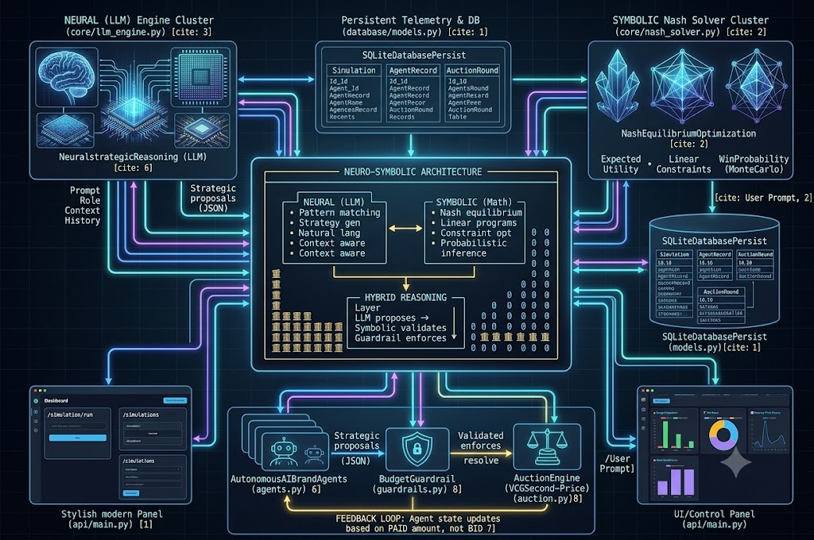
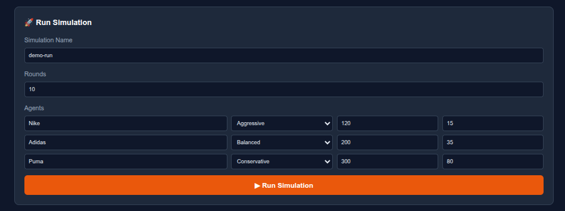
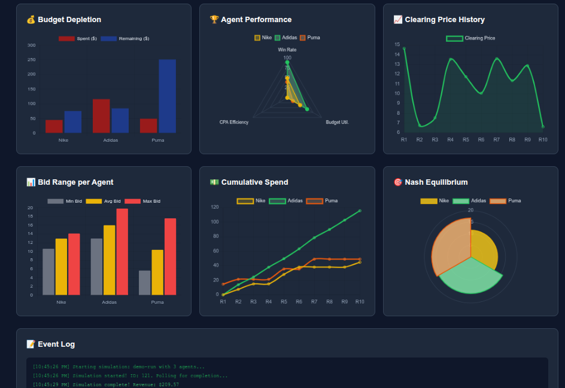

# 🏛️ Agentic Nash Marketing
<p align="center"><b>Multi-Agent Competitive Ad Auction with Nash Equilibrium</b></p>

<p align="center"><sub>FastAPI · SQLAlchemy · SciPy · Docker · pytest · Chart.js</sub></p>

<p align="center">
  
  
  
  
  
  
  
  
  
</p>

---

Autonomous AI brand agents compete in real-time ad auctions. Each agent uses an LLM to formulate bidding strategy, then a **game-theoretic Nash equilibrium** solver **computes optimal mixed strategies**. Budget guardrails prevent catastrophic depletion.

---

## 📋 Table of Contents

- [Why This Matters](#-why-this-matters)
- [Architecture](#-architecture)
  - [Agentic AI Criteria](#1-agentic-ai-criteria)
  - [Neuro-Symbolic Paradigm](#2-neuro-symbolic-paradigm)
  - [Nash Algorithm](#3-the-nash-algorithm)
- [Quick Start](#-quick-start)
  - [Docker](#docker-recommended)
  - [Local Development](#local-development)
  - [Dashboard Features](#-dashboard-features)
- [How It Works](#-how-it-works)
- [Testing](#-testing)
- [Tech Stack](#-tech-stack)
- [API Endpoints](#-api-endpoints)
- [Future Integration](#-future-integration)
- [Contributing](#-contributing)
- [License](#-license)

---

## 💡 Why This Matters

| Problem | Impact |
|:--------|:-------|
| **Advertisers** waste 30%+ of spend on suboptimal bidding | Nash equilibrium proves optimal strategies exist |
| **Auction platforms** lose revenue from unstable bidding wars | Equilibrium stabilizes clearing prices |
| **Campaign managers** rely on rules-of-thumb, not game theory | Data-driven strategy replaces intuition |

This project replaces guesswork with mathematical guarantees. It simulates how rational agents *should* bid, then validates against real auction outcomes.

### Use Cases

- **Ad tech R&D** — Test bidding algorithms before production deployment
- **Market design** — Analyze how impression supply affects advertiser behavior
- **Education** — Interactive demonstration of Nash equilibrium in a concrete domain
- **Procurement integration** — Bridge to [autonomous procurement swarm](https://github.com/aragit/autonomous-procurement-swarm)

---

## 🏗️ Architecture

### **1. Agentic AI Criteria**

An agentic AI system is defined by autonomous entities that perceive, decide, and act in an environment with persistent goals. Our system satisfies all six criteria:

| Criterion | Implementation | Evidence |
|:---|:---|:---|
| **Perception** | Agents observe market state (clearing price, competitor count, win rate, remaining budget) | `BrandAgent.decide_bid()` receives `MarketContext` with full market snapshot |
| **Decision** | LLM-powered strategic reasoning with structured JSON output | `LLMEngine.chat_completion()` generates bid strategy with role-appropriate bid percentage |
| **Action** | Agents submit bids to auction engine, pay clearing prices | `AuctionEngine.run_round()` executes VCG allocation and collects payments |
| **Persistent goals** | Budget preservation, CPA targets, win rate optimization over multiple rounds | `AgentState` tracks cumulative spend, conversions, win rate across entire campaign |
| **Memory** | Agents recall past round outcomes to adapt strategy | Round history fed into each LLM prompt as prior context |
| **Adaptation** | Strategy shifts dynamically based on market feedback | Agents adjust bid aggressiveness when over/under-performing CPA targets |

Unlike simple API wrappers, these agents:

- **Maintain state** across rounds (cumulative spend, conversions, win rate trajectory)
- **Adapt strategy** based on outcomes (LLM adjusts bid percentage when CPA targets drift)
- **Operate autonomously** without human intervention for the full simulation lifecycle
- **Face competitive pressure** from other agents, creating emergent market dynamics

### **2. Neuro-Symbolic Paradigm**

**1. NEURAL (LLM) POD Cluster (core/llm_engine.py)**

The left cluster is the Neural Strategic Reasoning (LLM) engine, providing dynamic, stochastic strategy generation based on pattern matching and contextual awareness.

*Responsibility:* The LLMEngineFactory (llm_engine.py) initializes either the rapid, deterministic MockLLMEngine or the slower, CPU-based TransformersEngine.

*Prompt context:* When an agent acts (agents.py), it renders the BrandPrompt (prompts.py). This injects natural language context—brand name, current win_rate (0.00 to 1.00), available impressions, competitor count, and full state history—into the LLM for strategy generation.

*Stochastic Proposals:* The engine generates non-deterministic strategy proposals (JSON). For example, an aggressive persona chooses a high bid multiplier (uniform(0.70, 0.95)) to maximize pattern matching for acquisition.

**2. SYMBOLIC (Math) POD Cluster (core/nash_solver.py)**

The right cluster is the NashEquilibriumOptimization system. This is the symbolic counterpart, defining mathematical guarantees, linear constraints, and optimal mixed-strategy equilibrium conditions.

*Staggered Win Probability:* The conceptual diagram notes probabilistic inference. When deterministic bidding loops failed in testing, the solution was moving to an iterative best-response solver with Monte Carlo noise. The NashEquilibriumSolver (nash_solver.py) now runs Monte Carlo simulations (5000 samples) to compute smooth, probabilistic win curves for any given bid level, enabling the staggered equilibrium requested by the developer.

*Expected Utility:* The solver calculates an agent's Expected Utility = (Valuation - Bid) × WinProbability.

*Solver Convergence:* The core of the solver relies on a softmax transformation with temperature annealing. Iterative loops continue (iter &lt; 100) until the standard symbolic criteria—convergence &lt; 0.01—is met.

**3. HYBRID REASONING Layer POD (core/agents.py &amp; core/guardrails.py)**

The central bottom cluster shows the core/agents.py, core/guardrails.py, and core/auction.py modules collaborating to enforce the neuro-symbolic feedback loop.

*Initialization (Hybrid Flow):* A POST /simulation/run (api/main.py) starts an async execution.

*Proposal (Neural → Hybrid):* The autonomous BrandAgent (agents.py) requests a bid decision. The Neural (LLM) Pod proposes a strategy (bid amount, spend cap).

*Validation (Hybrid → Symbolic):* The symbolic pod validates the proposal. The BudgetGuardrail (guardrails.py) enforces a strict linear constraint: the raw bid is capped at a hard threshold (remaining × 0.2 per bid) to prevent catastrophic depletion.

*Enforcement (Orchestration):* The finalized, validated bids move into the AuctionEngine (auction.py), which resolves the mechanics (Symbolic/Logic, VCG second-price format).

<p align="center">
  
</p>

This diagram shows how the conceptual Neuro-Symbolic blocks map to concrete code modules. The system uses a clean separation of concerns, persistent data models, and asynchronous execution (api/main.py) to orchestrate the hybrid reasoning process.

### 3. The Nash Algorithm

#### The Problem: The Tragedy of the Commons in Ad Auctions

Without equilibrium analysis, agents engage in destructive bidding wars:

| Scenario | Without Nash | With Nash Equilibrium |
|:---------|:-------------|:---------------------|
| Bidding dynamics | Nike $10 → Adidas $11 → Puma $12 → Nike $13… (escalation) | Nike $3.20, Adidas $2.80, Puma $2.50 (stable) |
| CPA trajectory | Explodes every round | Predictable, bounded |
| Budget depletion | Days | Campaign-long |
| Market stability | Volatile clearing prices | Predictable clearing prices |

#### How It Works: Iterative Best-Response with Softmax

```text
for iteration in range(max_iterations):
    for each agent:
        # Compute expected utility for every bid level
        # given opponents' current mixed strategies
        utilities = [expected_profit(bid, opponent_strategies)
                     for bid in bid_levels]

        # Softmax best response (temperature annealing)
        # High temp early = exploration. Low temp late = convergence.
        new_strategy = softmax(utilities / temperature)

    # Check convergence: did any agent's strategy change significantly?
    if max_strategy_change < tolerance:
        break  # Nash equilibrium found!
```

> **Mathematical guarantee:** At convergence, no agent can improve their expected utility by changing their strategy alone. This is the definition of Nash equilibrium.

#### Runtime Flow

```text
┌──────────┐    ┌──────────┐    ┌──────────┐    ┌──────────┐    ┌──────────┐
│ Configure│───▶│ Simulate │───▶│  Auction │───▶│   Nash   │───▶│ Analyze  │
│  Agents  │    │  Rounds  │    │ (VCG)    │    │  Solver  │    │Dashboard │
└──────────┘    └──────────┘    └──────────┘    └──────────┘    └──────────┘
     │               │               │               │               │
     │ Brand names   │ LLM decides   │ 2nd-price     │ Mixed-strategy│ Chart.js  │
     │ Budgets, CPAs │ bids per round│ allocation    │ equilibrium   │ visuals   │
     └───────────────┴───────────────┴───────────────┴───────────────┴───────────┘
```

---

## 🚀 Quick Start

### Docker (Recommended)

```bash
git clone https://github.com/aragit/nash-marketing-agents.git
cd nash-marketing-agents
docker-compose up --build
```

Open [http://localhost:8000](http://localhost:8000) for the dashboard.

### Local Development

```bash
python -m venv venv
source venv/bin/activate
pip install -r requirements.txt
uvicorn api.main:app --reload
```

---

## 📊 Dashboard Features

| Feature | Description |
|:--------|:------------|
| **System Health** | Real-time API, LLM backend, database status indicators |
| **Quick Stats** | Total simulations, last clearing price, cumulative revenue |
| **Run Simulation** | Configure agent count, strategies, budgets, CPA targets, rounds |
| **Budget Depletion Chart** | Grouped bar chart of amount spent vs remaining per agent |
| **Agent Performance (Radar)** | Multi-dimensional radar of win rate, budget utilization, CPA efficiency |
| **Clearing Price History** | Line chart of market dynamics across rounds |
| **Bid Range per Agent** | Min/avg/max bid range per agent |
| **Cumulative Spend** | Per-agent spend trajectory across rounds |
| **Nash Equilibrium (Polar Area)** | Expected bid distribution per agent at equilibrium |
| **Event Log** | Real-time stream of simulation events and agent decisions |

<p align="center">
  
</p>

<p align="center">
  
</p>

---

## 🎮 How It Works

1. **Configure** — Set brand names, strategies (aggressive / balanced / conservative), budgets, and target CPAs via the dashboard form.
2. **Simulate** — Each round, every agent queries its LLM with current market context (clearing price, competitor count, win rate, remaining budget) and receives a structured bid decision in JSON.
3. **Auction** — A second-price VCG auction allocates impressions to the highest bidders. Winners pay the next-highest bid. Budget guardrails cap per-round spend at 20% of remaining budget.
4. **Equilibrium** — After all rounds complete, the Nash solver iteratively computes optimal mixed strategies using softmax best-response dynamics with temperature annealing.
5. **Analyze** — The dashboard renders six charts (budget, agent performance radar, clearing price, bid range, cumulative spend, Nash equilibrium polar area) and an event log for post-hoc analysis.

---

## 🧪 Testing

```bash
pytest tests/ -v
```

49 tests covering:

| Module | Tests | What's Verified |
|:-------|:------|:----------------|
| `tests/test_agents.py` | 9 | Agent initialization, bid generation, state updates, CPA calculation |
| `tests/test_auction.py` | 6 | Empty auction, scarce supply, clearing price, revenue matching, budget depletion |
| `tests/test_properties.py` | 7 | **Monotonicity** (higher CPA → higher win rate), **Individual rationality** (no overpay, budget guardrails), **Nash bounds** (convergence, expected bid ≤ valuation) |
| `tests/test_nash.py` | 6 | Convergence, strategy validity, expected bid ranges, clearing price bounds |
| `tests/test_guardrails.py` | 8 | Soft warning, hard cap, emergency mode, system status aggregation |
| `tests/test_api.py` | 7 | Health endpoint, simulation lifecycle, Nash compute, error handling |
| `tests/test_e2e.py` | 6 | Full simulation lifecycle, role differentiation, budget guardrails, clearing price history, Nash equilibrium validation |

---

## 📦 Tech Stack

| Layer | Technology |
|:---|:---|
| **LLM** | MockLLM (default, instant) / Transformers CPU (optional, real inference) |
| **Math** | NumPy + SciPy (Nash equilibrium, optimization) |
| **Database** | SQLite (local) / PostgreSQL (production) |
| **API** | FastAPI + Pydantic v2 |
| **ORM** | SQLAlchemy 2.0 |
| **Dashboard** | Vanilla JS + Chart.js |
| **Container** | Docker + docker-compose |
| **Testing** | pytest + pytest-asyncio |

---

## 📝 API Endpoints

| Method | Endpoint | Description |
|:---|:---|:---|
| `GET` | `/health` | System health check (API status, LLM backend, database) |
| `POST` | `/simulation/run` | Start a new auction simulation (runs async, returns immediately) |
| `GET` | `/simulations` | List all past simulations (newest first) |
| `GET` | `/simulation/{id}` | Get full simulation detail (agents, rounds, Nash equilibrium) |
| `POST` | `/nash/compute` | Compute Nash equilibrium for arbitrary agent configurations |

---

## 🔮 Future Integration

This project is designed to integrate with [autonomous-procurement-swarm](https://github.com/aragit/autonomous-procurement-swarm):

| Procurement Swarm | Nash Marketing Agents | Integration Point |
|:---|:---|:---|
| Bilateral negotiation | N-player competitive auction | Shared LLM engine |
| Buyer vs. Seller | Brand vs. Brand | Shared PostgreSQL ledger |
| Pareto efficiency | Nash equilibrium | Unified dashboard |
| Cost minimization | Budget preservation | Cross-domain analytics |

---

## 🤝 Contributing

1. Fork the repository
2. Create a feature branch: `git checkout -b feat/your-feature`
3. Make changes and run tests: `pytest tests/ -v`
4. Commit: `git commit -m "feat: describe your change"`
5. Push: `git push origin feat/your-feature`
6. Open a Pull Request against `main`

Please ensure all 49 tests pass before submitting.

---

## 📄 License

MIT — see [LICENSE](LICENSE) for details.
