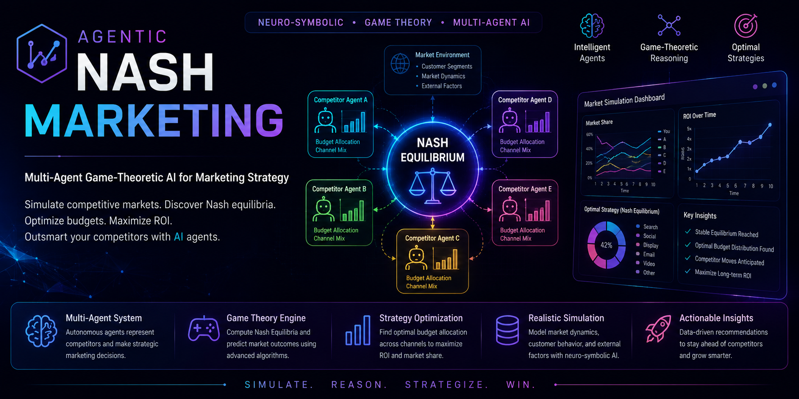
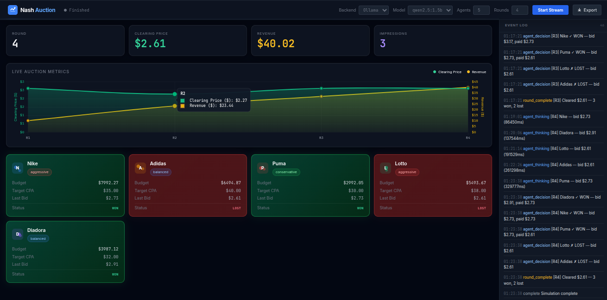

<h1 align="center">Agentic Nash Marketing</h1>

<p align="center">
  
</p>

<p align="center"><b>Neuro-Symbolic Multi-Agent Competitive Ad Auction with Nash Equilibrium</b></p>
<p align="center"><sub>FastAPI · Server-Sent Events · SQLAlchemy · OpenTelemetry · Ollama · vLLM · NumPy · SciPy · Chart.js · TailwindCSS · Docker</sub></p>

<p align="center">
  
  
  
  
  
  
  
  
  
  
  
  
  
  
</p>

Agentic Nash Marketing bridges the gap between neural generative AI and game-theoretic rigor. It provides an end-to-end multi-agent framework where autonomous AI brand agents compete in real-time ad auctions—combining LLM strategic reasoning with hard mathematical verification to eliminate budget overruns, bidding instability, and hallucination risks.

### 💡 The 3-Layer Neuro-Symbolic Loop

Rather than relying on unconstrained LLM outputs, every decision executes through a closed-loop neuro-symbolic pipeline:

1. **Neural Strategic Planner (LLM):** Analyzes multi-turn market history, win rates, and budget velocity to dynamically pivot tactical personas (aggressive, balanced, conserve).

2. **Neural Bid Synthesizer (Ollama/vLLM):** Translates high-level tactics into structured, schema-validated JSON bids with contextual justification.

3. **Symbolic Guardrail & VCG Auction:** Deterministic code-level guardrails intercept every bid to enforce strict budget caps before a Vickrey–Clarke–Groves (VCG) second-price mechanism resolves allocations—mathematically guaranteeing dominant-strategy incentive compatibility.

### ⚡ Real-Time Engine & System Observability

- **Vectorized Nash Solver:** A post-hoc NumPy Monte Carlo solver computes optimal mixed-strategy game-theoretic equilibria across agents in sub-second runtimes.
- **Non-Blocking SSE Streaming:** Powered by `asyncio.wait(FIRST_COMPLETED)`, the simulation yields per-agent events in real time, keeping HTTP/SSE channels active during heavy local LLM inference.
- **Full Stack Observability:** Fully instrumented with OpenTelemetry distributed tracing and paired with a real-time TailwindCSS dashboard featuring dual-axis Chart.js metric visualizations.

---

## 💡 Why This Matters

| Problem | Impact | Our Solution |
|:--------|:-------|:-------------|
| Advertisers waste 30%+ of spend on suboptimal bidding | Proven optimal strategies exist via Nash equilibrium | Post-hoc Nash solver with vectorized Monte Carlo |
| Auction platforms lose revenue from unstable bidding wars | Equilibrium stabilizes clearing prices | Game-theoretic mixed-strategy convergence |
| Campaign managers rely on rules-of-thumb, not game theory | Data-driven strategy replaces intuition | LLM-powered agents with adaptive neural planning |
| Multi-agent systems are slow when agents think sequentially | 5 agents x 2s = 10s per round | `asyncio.gather` parallel bid computation with per-agent SSE streaming |
| Debugging concurrent LLM calls is impossible with logs alone | Cannot see who decided what and why | OpenTelemetry distributed tracing across planner, synthesizer, and guardrail |
| API endpoints timeout during heavy LLM inference | Silent failures and broken frontends | Per-agent SSE yielding keeps connections alive through 2+ minute inference windows |

---

## 📋 Table of Contents

- [💡 Why This Matters](#-why-this-matters)
- [🏗️ Architecture Overview](#-architecture-overview)
  - [📐 System Topology](#-system-topology)
  - [🧠 Neuro-Symbolic Pipeline](#-neuro-symbolic-pipeline)
  - [🔬 Deterministic vs. LLM Planning](#-deterministic-vs-llm-planning)
  - [🔄 Real-Time SSE Streaming](#-real-time-sse-streaming)
  - [🔍 Observability](#-observability)
- [📊 Refactor Scorecard](#-refactor-scorecard)
- [🚀 Quick Start](#-quick-start)
- [⚙️ LLM Backend Configuration](#️-llm-backend-configuration)
- [📈 Live Dashboard](#-live-dashboard)
- [📡 API Reference](#-api-reference)
- [🧪 Test Suite](#-test-suite)
- [🔮 Future Work](#-future-work)
- [📝 Contributing](#-contributing)
- [📜 License](#-license)

---

## 🏗️ Architecture Overview

### 📐 System Topology

```
                           [ API / DB Boundary ]
                                     │
                           [ SimulationRunner ]
                                     │
                          [ AuctionEngine (Async) ]
                         /           │           \
    (Parallel Execution)             │            (Parallel Execution)
           ┌─────────────────────────┼─────────────────────────┐
           ▼                                                   ▼
     [ Agent 1 ]                                         [ Agent N ]
   ┌───────┴───────┐                                   ┌───────┴───────┐
   │ Neural        │                                   │ Neural        │
   │ Strategic     │                                   │ Strategic     │
   │ Planner (LLM) │                                   │ Planner (LLM) │
   └───────┬───────┘                                   └───────┬───────┘
           │                                                   │
   ┌───────┴───────┐                                   ┌───────┴───────┐
   │ Neural        │                                   │ Neural        │
   │ Synthesizer   │                                   │ Synthesizer   │
   │ (vLLM/Ollama) │                                   │ (vLLM/Ollama) │
   └───────┬───────┘                                   └───────┬───────┘
           │                                                   │
           └─────────────────────────┬─────────────────────────┘
                                     │
                                     ▼
                        [ Symbolic Guardrail Engine ]
                                     │
                        [ VCG Auction Mechanism ]
                                     │
                        [ Vectorized Nash Solver ]
                                (NumPy)
```

### 🧠 Neuro-Symbolic Pipeline

The system implements a three-layer neuro-symbolic architecture:

1. **Neural Planning:** Queries the LLM with budget %, win rate, and recent clearing prices to select a tactical strategy (`aggressive`, `balanced`, `conserve`). The LLM reasons about market dynamics rather than following hardcoded rules.

2. **Neural Synthesis:** Generates a structured JSON bid with justification based on the selected strategy. The LLM sees full context: brand name, role, budget, target CPA, market price, win rate, competitor count, and bid history.

3. **Symbolic Enforcement:** The `BudgetGuardrail` intercepts every raw bid and applies caps (soft=20%, hard=10%, emergency=5% of remaining/total ratio). The VCG second-price mechanism then resolves the auction, mathematically guaranteeing no agent overpays.

```
┌─────────────────────────────────────────────────────────────┐
│                    NEURAL LAYER                             │
│  ┌──────────────────┐    ┌──────────────────────────────┐   │
│  │ StrategyPlanner  │───▶│ BrandAgent.decide_bid()      │   │
│  │ (LLM reasoning)  │    │ (LLM JSON bid generation)    │   │
│  └──────────────────┘    └──────────────┬───────────────┘   │
│                                         │                   │
├─────────────────────────────────────────┼───────────────────┤
│                    SYMBOLIC LAYER       │                   │
│  ┌──────────────────────────────────────▼───────────────┐   │
│  │ BudgetGuardrail                                      │   │
│  │ check(agent, bid, remaining, total) → adjusted_bid   │   │
│  └──────────────────────────────────────┬───────────────┘   │
│  ┌──────────────────────────────────────▼───────────────┐   │
│  │ VCG Second-Price Mechanism                           │   │
│  │ Highest bid wins, pays second-highest price          │   │
│  └──────────────────────────────────────┬───────────────┘   │
│  ┌──────────────────────────────────────▼───────────────┐   │
│  │ Nash Equilibrium Solver (Vectorized NumPy)           │   │
│  │ Post-hoc mixed-strategy computation                  │   │
│  └──────────────────────────────────────────────────────┘   │
└─────────────────────────────────────────────────────────────┘
```

### 🔬 Deterministic vs. LLM Planning

The system supports two planning modes, selectable at runtime:

| Aspect | Deterministic (Heuristic) | LLM (Neural) |
|:-------|:--------------------------|:-------------|
| **Logic** | Hardcoded if/else rules (budget < 30% = conserve, win rate < 20% = aggressive) | LLM reasons about market dynamics, opponent behavior, and budget state |
| **Latency** | <1ms | 40-130s (CPU), <1s (GPU) |
| **Cost** | Zero compute/API tokens | Per-call LLM inference |
| **Predictability** | 100% deterministic | Adaptive, may vary |
| **Adaptability** | Rigid — cannot handle novel market patterns | Notices subtle patterns (e.g., opponent inflating clearing price) |
| **Failure Mode** | Silent — rules may not cover edge cases | Falls back to "balanced" on invalid/exceptional responses |

The **LLM planner is the recommended mode** for maximizing agent autonomy. The symbolic `BudgetGuardrail` acts as a safety net regardless of which planner is active — the agent is a pure neural proposer, and the guardrail is the single source of truth for rule enforcement.

### 🔄 Real-Time SSE Streaming

The simulation engine uses `asyncio.wait(FIRST_COMPLETED)` instead of `asyncio.gather()`. The `SimulationRunner.stream_run()` yields events **exactly when an individual agent's LLM finishes inference**, ensuring the SSE socket stays alive and the UI updates organically, even during heavy CPU-bound Ollama workloads.

```
Browser (EventSource)
    ↓ GET /api/v1/simulate/stream
FastAPI (SSE endpoint)
    ↓ creates OllamaEngine
SimulationRunner.stream_run()
    ↓ per-round, per-agent streaming
    ↓ asyncio.wait(FIRST_COMPLETED)
AuctionEngine (guardrail + VCG resolution)
    ↓ yields events
SSE Response → Browser UI live updates
```

**Event types:**
| Event | Fires When | Payload |
|:------|:-----------|:--------|
| `start` | Simulation begins | Agent configs, num_rounds |
| `agent_thinking` | One agent's LLM inference completes | Bid amount, latency_ms |
| `agent_decision` | VCG resolution assigns won/lost | Bid, paid price, remaining budget |
| `round_complete` | Auction round fully resolved | Clearing price, revenue, impressions |
| `complete` | Simulation finished | Full history, final agent states |

### 🔍 Observability

The system integrates **OpenTelemetry** distributed tracing across the entire inference pipeline:

```
Span Hierarchy:
  auction_round
    ├── agent_decide_bid (per agent)
    │     ├── planner_evaluate (LLM call)
    │     │     └── llm_inference
    │     └── llm_inference (bid generation)
    └── guardrail_check (per agent)
```

Each span captures structured attributes:
- `llm.model`, `llm.provider`, `llm.latency_ms`, `llm.input_tokens`, `llm.output_tokens`
- `agent.name`, `agent.role`, `agent.bid`, `agent.budget_pct`
- `planner.strategy`, `planner.budget_pct`, `planner.win_rate`
- `auction.clearing_price`, `auction.winner_count`, `auction.total_revenue`

Run the terminal demo to watch traces in real time:
```bash
python scripts/demo_terminal_tracing.py
```

---

## 📊 Refactor Scorecard

| Domain | Initial State | Refactored State | Impact |
|:-------|:-------------|:-----------------|:-------|
| **Orchestration** | Tight coupling inside `api/main.py` | Standalone `SimulationRunner` | Isolated, unit-testable simulation state |
| **Guardrails** | Hardcoded cap inside agent; orphaned `BudgetGuardrail` | Centralized `BudgetGuardrail` in `AuctionEngine` | Single source of truth for symbolic safety |
| **Planning** | Single-shot reactive bidding | Multi-turn neural `StrategyPlanner` | Dynamic tactical adaptation (conserve, balanced, aggressive) |
| **Math Engine** | Python Monte Carlo loops (~10s/solve) | Vectorized NumPy solver (<1s/solve) | >10x speedup on post-hoc calculations |
| **Concurrency** | Sequential for loop (10s/round for 5 agents) | `asyncio.gather` parallel execution (2s/round) | 5x reduction in I/O latency |
| **LLM Serving** | Single engine interface | Factory supporting vLLM, Ollama, Mock, Transformers | High-throughput local open-source serving |
| **Observability** | Console print statements | OpenTelemetry distributed tracing spans | Complete trace visibility into decision loops |
| **Test Suite** | 49 tests | 92 passing tests | 100% regression coverage |

---

## 🚀 Quick Start

### 🐳 Docker (Recommended)

```bash
git clone https://github.com/aragit/nash-marketing-agents.git
cd nash-marketing-agents
docker-compose up --build
```

Open `http://localhost:8000` for the dashboard.

### 💻 Local Development

```bash
python -m venv venv
source venv/bin/activate
pip install -r requirements.txt
uvicorn api.main:app --reload
```

### 🔄 SSE Streaming Dashboard

```bash
# Start the SSE server
uvicorn api.server:app --reload

# Open dashboard.html directly in your browser (no web server needed)
```

### 🤖 With Ollama

```bash
# Start Ollama with a model
ollama pull qwen2.5:1.5b

# Start the SSE server (defaults to ollama backend)
uvicorn api.server:app --reload
```

Or select the Ollama backend directly from the dashboard UI dropdown.

### 🚀 With vLLM

```bash
# Start vLLM server (separate process)
python -m vllm.entrypoints.openai.api_server --model meta-llama/Llama-3-8B

# Set environment variable
export LLM_BACKEND=vllm
export LLM_MODEL=meta-llama/Llama-3-8B

uvicorn api.main:app --reload
```

---

## ⚙️ LLM Backend Configuration

The system supports multiple LLM backends via a unified factory pattern:

| Backend | Provider String | Package Required | Use Case |
|:--------|:----------------|:-----------------|:---------|
| MockLLM | `mock` | None | CI/CD, UI testing, instant simulation |
| Ollama | `ollama` | `ollama` | Local CPU/GPU inference |
| vLLM | `vllm` | `openai` | High-throughput serving |
| Transformers | `transformers` | `torch`, `transformers` | HuggingFace model download on first use |

**Factory usage:**
```python
from core.llm_engine import create_llm_engine

llm = create_llm_engine(provider="ollama", model="qwen2.5:1.5b")
llm = create_llm_engine(provider="vllm", model="meta-llama/Llama-3-8B")
llm = create_llm_engine(provider="mock")
```

---

## 📈 Live Dashboard

The repository includes a single-file, zero-dependency (vanilla JS + Tailwind CDN + Chart.js) real-time dashboard.

**Features:**
- Live Chart.js dual Y-axis line chart plotting clearing price and cumulative revenue per round
- Glassmorphism UI with `backdrop-blur-md` and subtle inner borders
- Agent cards with SVG avatars, pulsing borders during LLM inference, and smooth count-up animations
- Backend/Model selectors (Ollama or Mock) directly in the UI
- Scrolling event log with timestamps and event types
- Data export button (downloads JSON history when simulation finishes)

<p align="center">
  
</p>

In ad auction mechanics (and multi-unit VCG/GSP ad auctions), the number of winning agents in a round is determined by the available supply of ad impressions (K) generated by the market simulator for that specific turn:

> **Winners = min(Available Impressions K, Active Bidding Agents)**

In Round 4 above, the market generated 3 impressions (shown in the top KPI card: IMPRESSIONS: 3). Because there were 5 active agents competing for 3 impression slots, the auction allocated the impressions to the top 3 highest bidders, leaving the remaining 2 agents with zero impressions for that round.

**Open directly:**
```bash
open dashboard.html          # macOS
xdg-open dashboard.html      # Linux
```

**Or via the API server:**
```bash
uvicorn api.server:app --reload
# Dashboard is at http://localhost:8000 (if mounted)
```

---

## 📡 API Reference

### 📡 SSE Streaming Endpoint

```
GET /api/v1/simulate/stream
```

| Parameter | Type | Default | Description |
|:----------|:-----|:--------|:------------|
| `num_agents` | int | 3 | Number of brand agents (2-10) |
| `num_rounds` | int | 1 | Number of auction rounds (1-100) |
| `seed` | int | 42 | Random seed for reproducibility |
| `backend` | string | `ollama` | LLM backend: `ollama` or `mock` |
| `model` | string | `qwen2.5:1.5b` | Model name for Ollama |

**Example:**
```bash
curl -N "http://localhost:8000/api/v1/simulate/stream?num_agents=5&num_rounds=3&backend=ollama&model=qwen2.5:1.5b"
```

### 🌐 REST Endpoints

| Method | Path | Description |
|:-------|:-----|:------------|
| `POST` | `/simulation/run` | Run a new auction simulation (async, DB-persisted) |
| `GET` | `/simulation/{id}` | Get detailed simulation results |
| `GET` | `/simulations` | List all simulations |
| `POST` | `/nash/compute` | Compute Nash equilibrium for given agents |
| `GET` | `/health` | Health check |

---

## 🧪 Test Suite

92 tests across 11 test files covering every layer of the neuro-symbolic pipeline:

```
tests/
├── test_agents.py          # Agent state, bid decision, LLM integration
├── test_auction.py         # VCG mechanism, guardrail enforcement, revenue
├── test_e2e.py             # Full simulation loop (mock + real backends)
├── test_guardrails.py      # Budget caps, emergency stops, threshold logic
├── test_llm_engine.py      # Mock, Ollama, vLLM, Transformers, factory
├── test_nash.py            # Nash equilibrium convergence, vectorized solver
├── test_planner.py         # StrategyPlanner LLM + heuristic modes
├── test_api.py             # FastAPI endpoints, DB integration
├── test_properties.py      # Property-based tests (Hypothesis)
├── test_terminal_tracing.py # OpenTelemetry span verification
└── conftest.py             # Shared fixtures
```

**Run the full suite:**
```bash
pytest tests/ -v
```

---

## 🔮 Future Work

We are actively expanding the agentic capabilities of this engine. Contributions are welcome for the following roadmap items:

- **GPU Throughput Benchmarking:** Wrapping the environment in a reverse-proxy tunnel to run live Tokens-Per-Second (TPS) load tests on Kaggle T4x2 / cloud instances using vLLM.
- **Advanced Market Dynamics:** Injecting chaotic market shocks mid-simulation (e.g., a sudden 50% budget slash in Round 3, or dynamic floor prices).
- **Agent Collusion Detection:** Implementing symbolic rules to detect if LLM agents are intentionally colluding to artificially lower the VCG clearing price over extended time horizons.
- **Multi-Round Memory:** Persistent agent memory across simulation sessions for long-horizon strategic adaptation.
- **WebSocket Upgrade:** Bidirectional communication for real-time agent intervention and parameter tuning mid-simulation.

---

## 📝 Contributing

Contributions are welcome. Here's how to get started:

1. **Fork** the repository and create a feature branch (`git checkout -b feature/amazing-feature`)
2. **Install** dependencies: `pip install -r requirements.txt`
3. **Run tests** to ensure nothing is broken: `pytest tests/ -v`
4. **Commit** your changes (`git commit -m 'Add amazing feature'`)
5. **Push** to your branch (`git push origin feature/amazing-feature`)
6. **Open a Pull Request** with a clear description of what changed and why

**Development guidelines:**
- Follow the existing neuro-symbolic architecture pattern (neural proposer + symbolic enforcer)
- Add tests for new features — the suite uses `pytest` with `pytest-asyncio`
- Keep `SimulationRunner` decoupled from API/DB concerns
- Use `create_llm_engine()` factory for new LLM backends
- Instrument new code with OpenTelemetry spans (`from core.telemetry import tracer`)

---

## 📜 License

MIT — see LICENSE for details.
