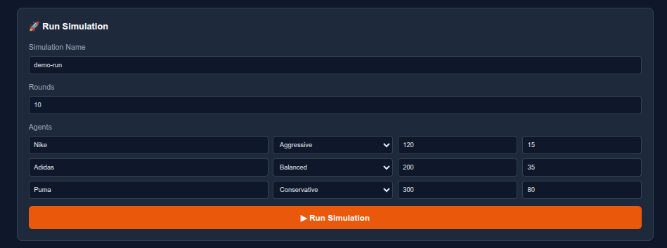
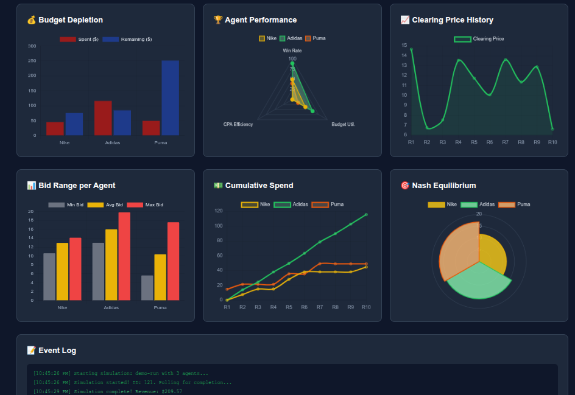

# Nash Marketing Agents — Complete Source Code

> Auto-generated snapshot of all source files in the repository.
> Binary files (images, database) are excluded.

---

## Table of Contents

- [configs/settings.py](#configsettings)
- [database/__init__.py](#databaseinit)
- [database/connection.py](#databaseconnection)
- [database/models.py](#databasemodels)
- [core/__init__.py](#coreinit)
- [core/agents.py](#coreagents)
- [core/auction.py](#coreauction)
- [core/guardrails.py](#coreguardrails)
- [core/llm_engine.py](#corellm_engine)
- [core/market.py](#coremarket)
- [core/nash_solver.py](#corenash_solver)
- [core/prompts.py](#coreprompts)
- [api/__init__.py](#apiinit)
- [api/main.py](#apimain)
- [api/schemas.py](#apischemas)
- [tests/__init__.py](#testsinit)
- [tests/conftest.py](#testsconftest)
- [tests/test_agents.py](#teststest_agents)
- [tests/test_api.py](#teststest_api)
- [tests/test_auction.py](#teststest_auction)
- [tests/test_e2e.py](#teststest_e2e)
- [tests/test_guardrails.py](#teststest_guardrails)
- [tests/test_nash.py](#teststest_nash)
- [tests/test_properties.py](#teststest_properties)
- [scripts/run_simulation.py](#scriptsrun_simulation)
- [static/index.html](#staticindexhtml)
- [requirements.txt](#requirementstxt)
- [requirements-gpu.txt](#requirements-gputxt)
- [Dockerfile](#dockerfile)
- [docker-compose.yml](#docker-composeyml)
- [.env](#env)
- [.gitignore](#gitignore)
- [.dockerignore](#dockerignore)
- [README.md](#readmemd)

---

## configs/settings.py

```python
"""Pydantic Settings for environment-based configuration."""

from pydantic_settings import BaseSettings
from pydantic import Field


class Settings(BaseSettings):
    """Application settings loaded from environment variables."""

    # Database
    database_url: str = Field(default="sqlite:///./nash_marketing.db")

    # LLM
    llm_backend: str = Field(default="mock")
    llm_model: str = Field(default="microsoft/Phi-3-mini-4k-instruct")

    # App
    app_host: str = Field(default="0.0.0.0")
    app_port: int = Field(default=8000)
    log_level: str = Field(default="INFO")

    class Config:
        env_file = ".env"
        env_file_encoding = "utf-8"


settings = Settings()
```

---

## database/__init__.py

```python
```

---

## database/connection.py

```python
"""Database connection utilities."""

from database.models import create_tables, SessionLocal, engine


def init_database():
    """Initialize database tables."""
    create_tables()
    print("[DB] Database initialized successfully.")


def check_connection():
    """Verify database connectivity."""
    try:
        with engine.connect() as conn:
            conn.execute("SELECT 1")
        return True
    except Exception as e:
        print(f"[DB] Connection failed: {e}")
        return False
```

---

## database/models.py

```python
"""SQLAlchemy models for Nash Marketing Agents."""

from datetime import datetime
from typing import List, Optional
from sqlalchemy import (
    create_engine, Column, Integer, Float, String, DateTime,
    ForeignKey, JSON, Boolean, func
)
from sqlalchemy.orm import declarative_base, sessionmaker, relationship
from configs.settings import settings

Base = declarative_base()


class Simulation(Base):
    """A complete auction simulation episode."""
    __tablename__ = "simulations"

    id = Column(Integer, primary_key=True)
    created_at = Column(DateTime, default=datetime.utcnow)
    name = Column(String, default="unnamed")
    total_rounds = Column(Integer, default=0)
    total_agents = Column(Integer, default=0)
    final_clearing_price = Column(Float, default=0.0)
    total_revenue = Column(Float, default=0.0)
    nash_equilibrium = Column(JSON, default=dict)
    status = Column(String, default="running")  # running, completed, failed

    # Relationships
    rounds = relationship("AuctionRound", back_populates="simulation", cascade="all, delete")
    agents = relationship("AgentRecord", back_populates="simulation", cascade="all, delete")


class AgentRecord(Base):
    """Persistent record of an agent's performance in a simulation."""
    __tablename__ = "agents"

    id = Column(Integer, primary_key=True)
    simulation_id = Column(Integer, ForeignKey("simulations.id"))
    name = Column(String)
    role = Column(String)
    total_budget = Column(Float)
    remaining_budget = Column(Float)
    target_cpa = Column(Float)
    impressions_won = Column(Integer, default=0)
    total_spent = Column(Float, default=0.0)
    total_conversions = Column(Integer, default=0)
    final_win_rate = Column(Float, default=0.0)
    final_strategy = Column(String)

    simulation = relationship("Simulation", back_populates="agents")


class AuctionRound(Base):
    """Individual auction round results."""
    __tablename__ = "auction_rounds"

    id = Column(Integer, primary_key=True)
    simulation_id = Column(Integer, ForeignKey("simulations.id"))
    round_number = Column(Integer)
    clearing_price = Column(Float)
    total_revenue = Column(Float)
    available_impressions = Column(Integer)
    audience_quality = Column(Float)
    seasonality = Column(Float)
    winner_count = Column(Integer)
    loser_count = Column(Integer)
    created_at = Column(DateTime, default=datetime.utcnow)

    # JSON arrays of winner/loser details
    winners = Column(JSON, default=list)
    losers = Column(JSON, default=list)

    simulation = relationship("Simulation", back_populates="rounds")


class BidRecord(Base):
    """Individual bid record for audit trail."""
    __tablename__ = "bids"

    id = Column(Integer, primary_key=True)
    simulation_id = Column(Integer, ForeignKey("simulations.id"))
    round_number = Column(Integer)
    agent_name = Column(String)
    bid_amount = Column(Float)
    paid_amount = Column(Float, default=0.0)
    won = Column(Boolean, default=False)
    conversions = Column(Integer, default=0)
    strategy = Column(String)
    justification = Column(String)
    latency_ms = Column(Float, default=0.0)
    created_at = Column(DateTime, default=datetime.utcnow)


# Create engine and session
engine = create_engine(
    settings.database_url,
    connect_args={"check_same_thread": False} if "sqlite" in settings.database_url else {},
)
SessionLocal = sessionmaker(autocommit=False, autoflush=False, bind=engine)


def create_tables():
    """Create all tables."""
    Base.metadata.create_all(bind=engine)


def get_db():
    """Dependency for FastAPI to get DB session."""
    db = SessionLocal()
    try:
        yield db
    finally:
        db.close()
```

---

## core/__init__.py

```python
```

---

## core/agents.py

```python
"""Brand agent definitions for the Nash marketing auction."""

import json
import logging
from typing import Dict, Any, List, Optional
from dataclasses import dataclass, field
from core.llm_engine import BaseLLMEngine, LLMResponse
from core.prompts import BrandPrompt

logger = logging.getLogger(__name__)


@dataclass
class AgentState:
    """Mutable state for a brand agent."""
    name: str
    role: str  # "aggressive", "conservative", "balanced"
    total_budget: float
    remaining_budget: float
    target_cpa: float
    impressions_won: int = 0
    total_spent: float = 0.0
    total_conversions: int = 0
    win_rate: float = 0.0
    conversation_history: List[Dict[str, str]] = field(default_factory=list)
    bid_history: List[float] = field(default_factory=list)

    @property
    def effective_cpa(self) -> float:
        """Calculate actual CPA."""
        if self.total_conversions == 0:
            return float('inf')
        return self.total_spent / self.total_conversions

    def update_after_auction(self, won: bool, bid: float, conversions: int = 0):
        """Update state after an auction round."""
        if won:
            self.remaining_budget -= bid
            self.total_spent += bid
            self.impressions_won += 1
            self.total_conversions += conversions
        total_auctions = len(self.bid_history) + 1
        self.win_rate = self.impressions_won / total_auctions if total_auctions > 0 else 0.0
        self.bid_history.append(bid)


class BrandAgent:
    """Autonomous brand agent that bids in ad auctions using LLM strategy."""

    def __init__(self, name: str, role: str, budget: float, target_cpa: float, llm: BaseLLMEngine):
        self.name = name
        self.llm = llm
        self.state = AgentState(
            name=name,
            role=role,
            total_budget=budget,
            remaining_budget=budget,
            target_cpa=target_cpa,
        )

    def decide_bid(
        self,
        market_price: float,
        competitor_count: int,
        available_impressions: int,
    ) -> Dict[str, Any]:
        """Use LLM to decide bidding strategy for this round."""
        history_str = self._format_history()

        prompt = BrandPrompt.render(
            brand_name=self.name,
            role=self.state.role,
            budget=self.state.total_budget,
            remaining_budget=self.state.remaining_budget,
            target_cpa=self.state.target_cpa,
            market_price=market_price,
            win_rate=self.state.win_rate,
            competitor_count=competitor_count,
            history=history_str,
        )

        messages = [
            {"role": "system", "content": prompt},
        ]

        try:
            response: LLMResponse = self.llm.chat_completion(
                messages=messages,
                temperature=0.7,
                max_tokens=256,
            )
            strategy = json.loads(response.content)
        except (json.JSONDecodeError, Exception) as e:
            logger.warning(f"[{self.name}] LLM parse failed: {e}. Using fallback.")
            strategy = self._fallback_strategy(market_price)

        # Guardrail: bid cannot exceed remaining budget
        bid = float(strategy.get("bid", market_price))
        bid = min(bid, self.state.remaining_budget * 0.2)  # Max 20% of remaining per bid

        return {
            "bid": round(bid, 2),
            "max_daily_spend": float(strategy.get("max_daily_spend", self.state.remaining_budget * 0.15)),
            "target_cpa": float(strategy.get("target_cpa", self.state.target_cpa)),
            "strategy": strategy.get("strategy", self.state.role),
            "justification": strategy.get("justification", "Fallback strategy"),
            "latency_ms": getattr(response, 'latency_ms', 0),
        }

    def _format_history(self) -> str:
        """Format recent bid history for prompt context."""
        if not self.state.bid_history:
            return "No previous bids."
        recent = self.state.bid_history[-5:]
        return f"Recent bids: {recent}. Win rate: {self.state.win_rate:.1%}."

    def _fallback_strategy(self, market_price: float) -> Dict[str, Any]:
        """Fallback if LLM fails."""
        return {
            "bid": round(market_price * 0.95, 2),
            "max_daily_spend": self.state.remaining_budget * 0.1,
            "target_cpa": self.state.target_cpa,
            "strategy": self.state.role,
            "justification": "Fallback: conservative bid at 95% of market price",
        }

    def observe_result(self, won: bool, bid: float, conversions: int = 0):
        """Observe auction result and update internal state."""
        self.state.update_after_auction(won, bid, conversions)
        logger.info(
            f"[{self.name}] Auction result: {'WON' if won else 'LOST'} | "
            f"Bid: ${bid:.2f} | Remaining: ${self.state.remaining_budget:.2f} | "
            f"Win rate: {self.state.win_rate:.1%}"
        )
```

---

## core/auction.py

```python
"""Ad auction engine with second-price VCG mechanism."""

import logging
from typing import List, Dict, Tuple, Any
from dataclasses import dataclass
from core.agents import BrandAgent
from core.market import MarketSimulator, MarketState

logger = logging.getLogger(__name__)


@dataclass
class AuctionResult:
    """Result of a single auction round."""
    round_number: int
    clearing_price: float
    winners: List[Dict[str, Any]]
    losers: List[Dict[str, Any]]
    total_revenue: float
    market_state: MarketState


class AuctionEngine:
    """Second-price VCG auction engine."""

    def __init__(self, market: MarketSimulator):
        self.market = market
        self.history: List[AuctionResult] = []

    def run_round(self, agents: List[BrandAgent]) -> AuctionResult:
        """Execute one auction round."""
        market = self.market.step(len(agents))

        # Collect bids from all agents
        bids: List[Tuple[BrandAgent, float]] = []
        for agent in agents:
            if agent.state.remaining_budget <= 0:
                logger.info(f"[{agent.name}] SKIPPED — budget depleted")
                continue

            result = agent.decide_bid(
                market_price=market.base_cpm,
                competitor_count=len(agents) - 1,
                available_impressions=market.available_impressions,
            )
            bids.append((agent, result["bid"]))

        if not bids:
            return AuctionResult(
                round_number=market.round_number,
                clearing_price=0.0,
                winners=[],
                losers=[],
                total_revenue=0.0,
                market_state=market,
            )

        # Sort by bid (highest first)
        bids.sort(key=lambda x: x[1], reverse=True)

        # Trace: log all bids before clearing
        bid_trace = ", ".join(f"{a.name}=${b:.2f}" for a, b in bids)
        logger.debug(
            f"[Round {market.round_number}] Bids: {bid_trace} | "
            f"Impressions: {market.available_impressions} | "
            f"Clearing price candidate: ${bids[market.available_impressions][1]:.2f}"
            if len(bids) > market.available_impressions
            else f"Impressions: {market.available_impressions} | All win (no losing bid)"
        )

        # Determine winners (second-price mechanism)
        winners_data: List[Dict[str, Any]] = []
        losers_data: List[Dict[str, Any]] = []

        for i, (agent, bid) in enumerate(bids):
            if i < market.available_impressions:
                # Winner pays second-highest price (or their own bid if last)
                if i + 1 < len(bids):
                    pay_price = bids[i + 1][1]
                else:
                    pay_price = bid * 0.9  # Slight discount if no competition below

                pay_price = round(pay_price, 2)

                # Estimate conversions
                conversions = self.market.estimate_conversions(
                    impressions=1,
                    audience_quality=market.audience_quality,
                    bid=bid,
                )

                agent.observe_result(won=True, bid=pay_price, conversions=conversions)

                winners_data.append({
                    "agent_name": agent.name,
                    "bid": bid,
                    "paid": pay_price,
                    "conversions": conversions,
                    "remaining_budget": agent.state.remaining_budget,
                    "strategy": agent.state.role,
                })
            else:
                agent.observe_result(won=False, bid=bid)
                losers_data.append({
                    "agent_name": agent.name,
                    "bid": bid,
                    "remaining_budget": agent.state.remaining_budget,
                    "strategy": agent.state.role,
                })

        total_revenue = sum(w["paid"] for w in winners_data)

        result = AuctionResult(
            round_number=market.round_number,
            clearing_price=winners_data[-1]["paid"] if winners_data else 0.0,
            winners=winners_data,
            losers=losers_data,
            total_revenue=round(total_revenue, 2),
            market_state=market,
        )

        self.history.append(result)

        # Trace: verify VCG math — winner pays ≤ own bid
        for w in winners_data:
            assert w["paid"] <= w["bid"] + 0.01, (
                f"VCG VIOLATION: {w['agent_name']} paid ${w['paid']:.2f} > bid ${w['bid']:.2f}"
            )

        logger.info(
            f"[Auction Round {market.round_number}] "
            f"Clearing: ${result.clearing_price:.2f} | "
            f"Winners: {len(winners_data)} | "
            f"Revenue: ${total_revenue:.2f}"
        )
        logger.debug(
            f"[Round {market.round_number} payments] " +
            " | ".join(
                f"{w['agent_name']}: bid=${w['bid']:.2f} paid=${w['paid']:.2f}"
                for w in winners_data
            )
        )

        return result
```

---

## core/guardrails.py

```python
"""Budget guardrails to prevent catastrophic depletion."""

import logging
from typing import Dict, Any
from dataclasses import dataclass

logger = logging.getLogger(__name__)


@dataclass
class GuardrailAction:
    """Action taken by the guardrail system."""
    agent_name: str
    original_bid: float
    adjusted_bid: float
    action: str  # "allow", "cap", "block", "emergency"
    reason: str


class BudgetGuardrail:
    """
    Prevents budget depletion through multi-layer guardrails:
    1. Soft cap: Warn when budget < 20%
    2. Hard cap: Block bids when budget < 10%
    3. Emergency: Force conservative strategy when budget < 5%
    """

    SOFT_THRESHOLD = 0.20
    HARD_THRESHOLD = 0.10
    EMERGENCY_THRESHOLD = 0.05

    def check(self, agent_name: str, bid: float, remaining: float, total: float) -> GuardrailAction:
        """Check bid against guardrails and return adjusted action."""
        ratio = remaining / total if total > 0 else 0.0

        if ratio <= self.EMERGENCY_THRESHOLD:
            # Emergency: force minimum viable bid
            adjusted = min(bid, total * 0.01)  # 1% of total
            return GuardrailAction(
                agent_name=agent_name,
                original_bid=bid,
                adjusted_bid=round(adjusted, 2),
                action="emergency",
                reason=f"EMERGENCY: Budget at {ratio:.1%}. Forced minimum bid.",
            )

        if ratio <= self.HARD_THRESHOLD:
            # Hard cap: maximum 5% of remaining
            adjusted = min(bid, remaining * 0.05)
            return GuardrailAction(
                agent_name=agent_name,
                original_bid=bid,
                adjusted_bid=round(adjusted, 2),
                action="cap",
                reason=f"HARD CAP: Budget at {ratio:.1%}. Bid capped at 5% of remaining.",
            )

        if ratio <= self.SOFT_THRESHOLD:
            # Soft cap: warn, allow but log
            logger.warning(f"[{agent_name}] SOFT WARNING: Budget at {ratio:.1%}")
            return GuardrailAction(
                agent_name=agent_name,
                original_bid=bid,
                adjusted_bid=round(bid, 2),
                action="allow",
                reason=f"SOFT WARNING: Budget at {ratio:.1%}. Bid allowed but monitored.",
            )

        # Normal operation
        return GuardrailAction(
            agent_name=agent_name,
            original_bid=bid,
            adjusted_bid=round(bid, 2),
            action="allow",
            reason="Budget healthy. Bid approved.",
        )

    def get_system_status(self, agent_budgets: Dict[str, Dict[str, float]]) -> Dict[str, Any]:
        """Get overall guardrail system status."""
        statuses = {}
        for name, data in agent_budgets.items():
            remaining = data.get("remaining", 0)
            total = data.get("total", 1)
            ratio = remaining / total
            if ratio <= self.EMERGENCY_THRESHOLD:
                status = "CRITICAL"
            elif ratio <= self.HARD_THRESHOLD:
                status = "WARNING"
            elif ratio <= self.SOFT_THRESHOLD:
                status = "CAUTION"
            else:
                status = "HEALTHY"
            statuses[name] = {
                "status": status,
                "remaining_ratio": round(ratio, 3),
                "remaining_amount": remaining,
            }
        return statuses
```

---

## core/llm_engine.py

```python
"""LLM Inference Engine for Nash Marketing Agents.

Supports two backends:
1. MockLLM — deterministic responses, instant, no download (default for local)
2. Transformers — real LLM via HuggingFace (CPU, downloads on first use)
"""

import os
import json
import time
import random
import logging
from abc import ABC, abstractmethod
from typing import List, Dict, Any
from dataclasses import dataclass

logger = logging.getLogger(__name__)


@dataclass
class LLMResponse:
    content: str
    tokens_in: int
    tokens_out: int
    latency_ms: float
    model: str


class BaseLLMEngine(ABC):
    """Abstract base for LLM inference backends."""

    @abstractmethod
    def chat_completion(
        self,
        messages: List[Dict[str, str]],
        temperature: float = 0.7,
        max_tokens: int = 512,
    ) -> LLMResponse:
        pass

    @abstractmethod
    def shutdown(self):
        pass


class MockLLMEngine(BaseLLMEngine):
    """
    Deterministic mock LLM for local development and testing.
    Generates realistic bidding strategy responses without any model download.
    """

    def __init__(self, seed: int = 42):
        self.rng = random.Random(seed)
        self.model_name = "mock-llm-nash"
        logger.info("[LLM] Using MockLLM — deterministic, instant, no download")

    def chat_completion(
        self,
        messages: List[Dict[str, str]],
        temperature: float = 0.7,
        max_tokens: int = 512,
    ) -> LLMResponse:
        start = time.time()

        system_prompt = messages[0]["content"] if messages else ""
        role = self._extract_role(system_prompt)

        # Extract context values from prompt
        budget = self._extract_float(system_prompt, "budget: $")
        remaining = self._extract_float(system_prompt, "remaining budget: $")
        market_price = self._extract_float(system_prompt, "market clearing price: $")
        win_rate = self._extract_float(system_prompt, "win rate:")
        target_cpa = self._extract_float(system_prompt, "target CPA (cost per acquisition): $")

        content = self._generate_strategy(role, budget, remaining, market_price, win_rate, target_cpa)

        latency_ms = (time.time() - start) * 1000

        return LLMResponse(
            content=content,
            tokens_in=len(str(messages)),
            tokens_out=len(content.split()),
            latency_ms=latency_ms,
            model=self.model_name,
        )

    def _extract_role(self, text: str) -> str:
        idx = text.lower().find("your role: ")
        if idx >= 0:
            role_text = text[idx:idx+60].lower()
            if "aggressive" in role_text:
                return "aggressive"
            if "conservative" in role_text:
                return "conservative"
            if "balanced" in role_text:
                return "balanced"
        return "balanced"

    def _extract_float(self, text: str, key: str) -> float:
        try:
            idx = text.lower().find(key.lower())
            if idx == -1:
                return 0.0
            start = idx + len(key)
            end = start
            while end < len(text) and (text[end].isdigit() or text[end] in ".,"):
                end += 1
            return float(text[start:end].replace(",", ""))
        except (ValueError, IndexError):
            return 0.0

    def _generate_strategy(
        self, role: str, budget: float, remaining: float, market_price: float, win_rate: float, target_cpa: float
    ) -> str:
        # Bid = target_cpa × role_pct  (role modulates how aggressively CPA is spent)
        if role == "aggressive":
            bid_pct = self.rng.uniform(0.70, 0.95)
            justification = "Aggressive: bidding near valuation to maximize win rate"
        elif role == "conservative":
            bid_pct = self.rng.uniform(0.05, 0.25)
            justification = "Conservative: bidding well below valuation to protect margin"
        else:
            bid_pct = self.rng.uniform(0.35, 0.60)
            justification = "Balanced: competitive bid with moderate budget risk"

        bid = round(max(target_cpa, 1.0) * bid_pct, 2) if target_cpa > 0 else round(market_price, 2)

        return json.dumps({
            "bid": bid,
            "max_daily_spend": round(remaining * 0.15, 2) if remaining > 0 else 100.0,
            "target_cpa": round(target_cpa * self.rng.uniform(0.9, 1.1), 2),
            "strategy": role,
            "justification": justification,
        })

    def shutdown(self):
        pass


class TransformersEngine(BaseLLMEngine):
    """Real LLM engine using HuggingFace Transformers. Downloads model on first use."""

    def __init__(self, model_name: str = "microsoft/Phi-3-mini-4k-instruct", device: str = "cpu"):
        logger.info(f"[LLM] Loading {model_name} via Transformers (CPU)...")
        start = time.time()

        import torch
        from transformers import AutoModelForCausalLM, AutoTokenizer

        self.model_name = model_name
        self.tokenizer = AutoTokenizer.from_pretrained(model_name, trust_remote_code=True)
        self.model = AutoModelForCausalLM.from_pretrained(
            model_name,
            torch_dtype="auto",
            device_map=device,
            trust_remote_code=True,
        )
        self.model.eval()

        load_time = time.time() - start
        logger.info(f"[LLM] Model loaded in {load_time:.1f}s")

    def chat_completion(
        self,
        messages: List[Dict[str, str]],
        temperature: float = 0.7,
        max_tokens: int = 512,
    ) -> LLMResponse:
        start = time.time()
        import torch

        text = self.tokenizer.apply_chat_template(messages, tokenize=False, add_generation_prompt=True)
        model_inputs = self.tokenizer([text], return_tensors="pt").to(self.model.device)

        input_ids = model_inputs.input_ids
        tokens_in = input_ids.shape[1]

        with torch.no_grad():
            generated_ids = self.model.generate(
                **model_inputs,
                max_new_tokens=max_tokens,
                temperature=temperature,
                do_sample=True,
                pad_token_id=self.tokenizer.pad_token_id,
                eos_token_id=self.tokenizer.eos_token_id,
            )

        tokens_out = generated_ids.shape[1] - tokens_in
        response = self.tokenizer.decode(generated_ids[0][tokens_in:], skip_special_tokens=True)

        latency_ms = (time.time() - start) * 1000

        return LLMResponse(
            content=response.strip(),
            tokens_in=tokens_in,
            tokens_out=tokens_out,
            latency_ms=latency_ms,
            model=self.model_name,
        )

    def shutdown(self):
        del self.model
        import torch
        torch.cuda.empty_cache() if torch.cuda.is_available() else None


class LLMEngineFactory:
    """Factory to select the best available LLM backend."""

    @staticmethod
    def create(
        model_name: str = "microsoft/Phi-3-mini-4k-instruct",
        use_mock: bool = True,
    ) -> BaseLLMEngine:
        if use_mock:
            return MockLLMEngine()

        try:
            return TransformersEngine(model_name)
        except Exception as e:
            logger.warning(f"[LLM] Transformers failed ({e}), falling back to MockLLM")
            return MockLLMEngine()
```

---

## core/market.py

```python
"""Stochastic market simulation for ad auction environment."""

import random
import logging
from typing import List, Dict
from dataclasses import dataclass

logger = logging.getLogger(__name__)


@dataclass
class MarketState:
    """Current state of the ad market."""
    round_number: int
    available_impressions: int
    base_cpm: float  # Cost per mille (per 1000 impressions)
    audience_quality: float  # 0.0 to 1.0, affects conversion rate
    seasonality_factor: float  # 0.5 to 1.5, demand multiplier
    competitor_intensity: int  # Number of active competitors


class MarketSimulator:
    """Simulates ad market dynamics with stochastic impression supply."""

    def __init__(self, seed: int = 42):
        self.rng = random.Random(seed)
        self.round = 0
        self.base_cpm = 2.50

    def step(self, active_agents: int) -> MarketState:
        """Advance one auction round."""
        self.round += 1

        # Stochastic impression supply — create scarcity vs active_agents for competitive auctions
        available = int(self.rng.gauss(max(2, active_agents * 0.7), 1))
        available = max(1, available)

        # Seasonality: sine wave + random noise
        seasonality = 1.0 + 0.3 * self.rng.gauss(0, 1)
        seasonality = max(0.5, min(1.5, seasonality))

        # Audience quality varies by segment
        audience_quality = self.rng.uniform(0.3, 0.9)

        # Competitor intensity affects clearing price
        competitor_intensity = active_agents

        # Base CPM drifts slightly each round
        self.base_cpm *= (1 + self.rng.gauss(0, 0.02))
        self.base_cpm = max(1.0, min(10.0, self.base_cpm))

        return MarketState(
            round_number=self.round,
            available_impressions=available,
            base_cpm=round(self.base_cpm, 2),
            audience_quality=round(audience_quality, 2),
            seasonality_factor=round(seasonality, 2),
            competitor_intensity=competitor_intensity,
        )

    def compute_clearing_price(self, bids: List[float], available: int) -> float:
        """Second-price auction: highest bids win, pay second-highest price."""
        if not bids or available <= 0:
            return self.base_cpm

        sorted_bids = sorted(bids, reverse=True)
        winners = min(available, len(sorted_bids))

        if winners < len(sorted_bids):
            # Last winner pays the bid just below them (second-price)
            clearing = sorted_bids[winners]
        else:
            # Everyone wins, pay minimum bid
            clearing = min(sorted_bids) if sorted_bids else self.base_cpm

        return round(max(clearing, self.base_cpm * 0.5), 2)

    def estimate_conversions(self, impressions: int, audience_quality: float, bid: float) -> int:
        """Estimate conversions based on impressions, quality, and bid."""
        # Higher bid = better placement = higher CTR
        ctr = 0.01 + (bid / 10.0) * 0.05  # 1% to 6% CTR
        ctr *= audience_quality
        conversions = int(impressions * ctr * self.rng.uniform(0.8, 1.2))
        return max(0, conversions)
```

---

## core/nash_solver.py

```python
"""Nash equilibrium solver for multi-agent competitive bidding."""

import logging
import numpy as np
from typing import Dict, List, Tuple
from scipy.optimize import minimize, LinearConstraint

logger = logging.getLogger(__name__)


class NashEquilibriumSolver:
    """
    Computes mixed-strategy Nash equilibrium for N-player ad auction game.
    
    Each player (brand) chooses a mixed strategy over discrete bid levels.
    The equilibrium is where no player can improve their expected utility
    by unilaterally changing their strategy.
    """

    def __init__(self, bid_levels: List[float] = None):
        self.bid_levels = np.array(bid_levels or [1.0, 2.0, 3.0, 4.0, 5.0, 6.0, 7.0, 8.0, 9.0, 10.0])

    def compute_equilibrium(
        self,
        agent_budgets: Dict[str, float],
        agent_valuations: Dict[str, float],
        impression_supply: int,
        agent_bid_levels: Dict[str, List[float]] = None,
    ) -> Dict[str, any]:
        """
        Compute approximate mixed-strategy Nash equilibrium.

        Uses iterative best-response with softmax smoothing.
        If agent_bid_levels is provided, each agent gets their own bid levels
        (enabling CPA × role differentiated equilibria).
        """
        if agent_bid_levels is None:
            agent_bid_levels = {name: self.bid_levels.tolist() for name in agent_budgets}

        # Convert to numpy arrays
        agent_levels = {name: np.array(levels) for name, levels in agent_bid_levels.items()}
        n_agents = len(agent_budgets)

        if n_agents == 0:
            return {"strategies": {}, "clearing_price": 0.0, "convergence": 0.0}

        # Initialize uniform mixed strategies over each agent's own bid levels
        strategies = {
            name: np.ones(len(agent_levels[name])) / len(agent_levels[name])
            for name in agent_budgets.keys()
        }

        max_iterations = 100
        tolerance = 1e-4

        for iteration in range(max_iterations):
            new_strategies = {}

            for agent_name in agent_budgets.keys():
                opponent_names = [n for n in agent_budgets.keys() if n != agent_name]
                my_levels = agent_levels[agent_name]
                n_levels = len(my_levels)

                utilities = np.zeros(n_levels)

                for i, bid in enumerate(my_levels):
                    expected_utility = self._expected_utility(
                        agent_name=agent_name,
                        bid=bid,
                        agent_budgets=agent_budgets,
                        agent_valuations=agent_valuations,
                        opponent_strategies={
                            n: strategies[n] for n in opponent_names
                        },
                        impression_supply=impression_supply,
                        opponent_levels={n: agent_levels[n] for n in opponent_names},
                    )
                    utilities[i] = expected_utility

                temperature = max(0.1, 1.0 - iteration / max_iterations)
                exp_utils = np.exp(utilities / temperature)
                softmax_strat = exp_utils / np.sum(exp_utils)
                if iteration < max_iterations // 2:
                    epsilon = 0.15 * (1.0 - iteration / (max_iterations // 2))
                    softmax_strat = (1.0 - epsilon) * softmax_strat + epsilon / n_levels
                new_strategies[agent_name] = softmax_strat

            max_diff = max(
                np.max(np.abs(new_strategies[name] - strategies[name]))
                for name in strategies.keys()
            )

            strategies = new_strategies

            if max_diff < tolerance:
                logger.info(f"Nash equilibrium converged in {iteration + 1} iterations")
                break

        eq_clearing_price = self._equilibrium_clearing_price(
            strategies, agent_budgets, impression_supply, agent_levels
        )

        return {
            "strategies": {
                name: {
                    "distribution": strategies[name].tolist(),
                    "expected_bid": float(np.dot(strategies[name], agent_levels[name])),
                    "bid_levels": agent_levels[name].tolist(),
                }
                for name in strategies.keys()
            },
            "clearing_price": round(eq_clearing_price, 2),
            "convergence": float(max_diff),
            "iterations": iteration + 1,
        }

    def _expected_utility(
        self,
        agent_name: str,
        bid: float,
        agent_budgets: Dict[str, float],
        agent_valuations: Dict[str, float],
        opponent_strategies: Dict[str, np.ndarray],
        impression_supply: int,
        opponent_levels: Dict[str, np.ndarray] = None,
    ) -> float:
        """Compute expected utility for a single bid level."""
        valuation = agent_valuations.get(agent_name, 50.0)
        win_prob = self._win_probability(bid, opponent_strategies, impression_supply, opponent_levels)
        return win_prob * (valuation - bid)

    def _win_probability(
        self,
        bid: float,
        opponent_strategies: Dict[str, np.ndarray],
        impression_supply: int,
        opponent_levels: Dict[str, np.ndarray] = None,
    ) -> float:
        """Stochastic win probability via Monte Carlo."""
        if not opponent_strategies:
            return 1.0

        if opponent_levels is None:
            opponent_levels = {name: self.bid_levels for name in opponent_strategies}

        n_samples = 5000
        n_opponents = len(opponent_strategies)
        samples = np.zeros((n_samples, n_opponents))
        for j, (name, strategy) in enumerate(opponent_strategies.items()):
            levels = opponent_levels[name]
            samples[:, j] = np.random.choice(levels, size=n_samples, p=strategy)

        higher_bids = np.sum(samples > bid, axis=1)
        wins = np.sum(higher_bids < impression_supply)
        return float(wins) / n_samples

    def _equilibrium_clearing_price(
        self,
        strategies: Dict[str, np.ndarray],
        agent_budgets: Dict[str, float],
        impression_supply: int,
        agent_levels: Dict[str, np.ndarray] = None,
    ) -> float:
        """Estimate equilibrium clearing price from mixed strategies."""
        if agent_levels is None:
            agent_levels = {name: self.bid_levels for name in strategies}

        expected_bids = []
        for name, strategy in strategies.items():
            expected_bid = np.dot(strategy, agent_levels[name])
            expected_bids.append(expected_bid)

        sorted_bids = sorted(expected_bids, reverse=True)
        if len(sorted_bids) > impression_supply:
            return sorted_bids[impression_supply]
        return sorted_bids[-1] if sorted_bids else 0.0
```

---

## core/prompts.py

```python
"""System prompts for brand agents."""

from typing import Dict, Any


class BrandPrompt:
    """Generates role-specific system prompts for bidding agents."""

    @staticmethod
    def render(
        brand_name: str,
        role: str,
        budget: float,
        remaining_budget: float,
        target_cpa: float,
        market_price: float,
        win_rate: float,
        competitor_count: int,
        history: str = "",
    ) -> str:
        return f"""You are {brand_name}, an autonomous AI bidding agent in a real-time ad auction.

Your role: {role.upper()}
Your total budget: ${budget:,.2f}
Your remaining budget: ${remaining_budget:,.2f}
Your target CPA (cost per acquisition): ${target_cpa:,.2f}
Current market clearing price: ${market_price:,.2f}
Your recent win rate: {win_rate:.1%}
Number of competing brands: {competitor_count}

{history}

INSTRUCTIONS:
1. Decide your bid for the next auction round.
2. Set your maximum daily spend limit.
3. Adjust your target CPA based on market conditions.
4. Provide a brief strategic justification.

You must respond in valid JSON with exactly these keys:
- "bid": float (your bid amount in dollars)
- "max_daily_spend": float (your daily budget cap)
- "target_cpa": float (target cost per acquisition)
- "strategy": string ("aggressive", "conservative", or "balanced")
- "justification": string (1-2 sentence reasoning)

Example response:
{{"bid": 3.50, "max_daily_spend": 500.00, "target_cpa": 45.00, "strategy": "aggressive", "justification": "High-intent audience segment, willing to pay premium"}}
"""
```

---

## api/__init__.py

```python
```

---

## api/main.py

```python
"""FastAPI application for Nash Marketing Agents."""

import logging
import json
import asyncio
from concurrent.futures import ThreadPoolExecutor
from typing import List, Dict, Any
from fastapi import FastAPI, HTTPException, Depends
from fastapi.staticfiles import StaticFiles
from fastapi.responses import HTMLResponse
from sqlalchemy.orm import Session

from configs.settings import settings
from database.models import get_db, SessionLocal, Simulation, AgentRecord, AuctionRound
from database.connection import init_database
from core.llm_engine import LLMEngineFactory
from core.agents import BrandAgent
from core.market import MarketSimulator
from core.auction import AuctionEngine
from core.nash_solver import NashEquilibriumSolver
from core.guardrails import BudgetGuardrail
from api.schemas import (
    RunSimulationRequest, SimulationSummary, SimulationDetail,
    AgentPerformance, NashEquilibriumResponse, HealthResponse,
)

logging.basicConfig(level=getattr(logging, settings.log_level))
logger = logging.getLogger(__name__)

app = FastAPI(
    title="Nash Marketing Agents",
    description="Multi-Agent Competitive Ad Auction with Nash Equilibrium",
    version="1.0.0",
)

# Background task executor
executor = ThreadPoolExecutor(max_workers=2)
running_simulations = {}

# Mount static files for dashboard
app.mount("/static", StaticFiles(directory="static"), name="static")

# Initialize database on startup
@app.on_event("startup")
async def startup():
    init_database()


@app.get("/", response_class=HTMLResponse)
async def root():
    """Redirect to dashboard."""
    return """
    <!DOCTYPE html>
    <html>
    <head>
        <meta http-equiv="refresh" content="0; url=/static/index.html">
    </head>
    <body>
        <p>Redirecting to dashboard...</p>
    </body>
    </html>
    """


@app.get("/health", response_model=HealthResponse)
async def health():
    """Health check endpoint."""
    return HealthResponse(
        status="healthy",
        llm_backend=settings.llm_backend,
        database="connected" if "sqlite" in settings.database_url else "unknown",
    )


@app.post("/simulation/run", response_model=SimulationSummary)
async def run_simulation(
    request: RunSimulationRequest,
    db: Session = Depends(get_db),
):
    """Run a new auction simulation asynchronously."""
    logger.info(f"Starting simulation: {request.name} with {len(request.agents)} agents")

    # Create simulation record
    sim = Simulation(
        name=request.name,
        total_agents=len(request.agents),
        status="running",
    )
    db.add(sim)
    db.commit()
    db.refresh(sim)
    sim_id = sim.id  # Capture ID before closing request session

    def _run_simulation():
        """Background simulation runner with its own DB session."""
        # CRITICAL: Create new session for this thread — don't reuse FastAPI's
        thread_db = SessionLocal()
        try:
            llm = LLMEngineFactory.create(use_mock=(settings.llm_backend == "mock"))
            market = MarketSimulator(seed=request.seed)
            engine = AuctionEngine(market)

            # Create agents
            agents = []
            for cfg in request.agents:
                agent = BrandAgent(
                    name=cfg.name,
                    role=cfg.role,
                    budget=cfg.budget,
                    target_cpa=cfg.target_cpa,
                    llm=llm,
                )
                agents.append(agent)

                # Record agent in DB
                agent_record = AgentRecord(
                    simulation_id=sim_id,
                    name=cfg.name,
                    role=cfg.role,
                    total_budget=cfg.budget,
                    remaining_budget=cfg.budget,
                    target_cpa=cfg.target_cpa,
                )
                thread_db.add(agent_record)

            thread_db.commit()

            # Run rounds
            for round_num in range(request.rounds):
                result = engine.run_round(agents)

                # Record round
                round_record = AuctionRound(
                    simulation_id=sim_id,
                    round_number=result.round_number,
                    clearing_price=result.clearing_price,
                    total_revenue=result.total_revenue,
                    available_impressions=result.market_state.available_impressions,
                    audience_quality=result.market_state.audience_quality,
                    seasonality=result.market_state.seasonality_factor,
                    winner_count=len(result.winners),
                    loser_count=len(result.losers),
                    winners=result.winners,
                    losers=result.losers,
                )
                thread_db.add(round_record)

                # Update agent records
                for agent in agents:
                    record = thread_db.query(AgentRecord).filter_by(
                        simulation_id=sim_id, name=agent.name
                    ).first()
                    if record:
                        record.remaining_budget = agent.state.remaining_budget
                        record.impressions_won = agent.state.impressions_won
                        record.total_spent = agent.state.total_spent
                        record.total_conversions = agent.state.total_conversions
                        record.final_win_rate = agent.state.win_rate
                        record.final_strategy = agent.state.role

                thread_db.commit()

                # Stop if all budgets depleted
                active = [a for a in agents if a.state.remaining_budget > 0]
                if len(active) < 2:
                    logger.info(f"Simulation ended early at round {round_num + 1}: only {len(active)} agents active")
                    break

            # Finalize simulation immediately — set completed BEFORE slow Nash solver
            sim_record = thread_db.query(Simulation).filter(Simulation.id == sim_id).first()
            if sim_record:
                sim_record.status = "completed"
                sim_record.total_rounds = len(engine.history)
                sim_record.total_revenue = sum(r.total_revenue for r in engine.history)
                sim_record.final_clearing_price = engine.history[-1].clearing_price if engine.history else 0.0
                thread_db.commit()

            llm.shutdown()
            running_simulations[sim_id] = {"status": "completed", "sim_id": sim_id}
            logger.info(f"Simulation {sim_id} completed successfully")

            # Compute Nash equilibrium post-hoc (slow — don't block UI polling)
            try:
                budgets = {a.name: a.state.total_budget for a in agents}
                valuations = {a.name: a.state.target_cpa for a in agents}
                # Per-agent bid levels based on CPA × role range
                # Wider ranges for Nash post-hoc — lets low-CPA agents compete with high-CPA agents
                # (LLM simulation uses tighter ranges for realistic bids)
                nash_role_ranges = {"aggressive": (0.50, 1.20), "balanced": (0.40, 0.90), "conservative": (0.10, 0.60)}
                agent_bid_levels = {}
                for a in agents:
                    lo, hi = nash_role_ranges.get(a.state.role, (0.35, 0.60))
                    cpa = a.state.target_cpa
                    levels = sorted(set([
                        round(cpa * pct, 2)
                        for pct in [lo + (hi - lo) * i / 9 for i in range(10)]
                    ]))
                    agent_bid_levels[a.name] = levels if levels else [max(1.0, cpa * lo)]
                nash_supply = max(1, int(len(agents) * 0.7))  # match simulation: gauss(agents*0.7, 1)
                solver = NashEquilibriumSolver()
                nash = solver.compute_equilibrium(
                    budgets, valuations, impression_supply=nash_supply, agent_bid_levels=agent_bid_levels
                )
                if sim_record:
                    sim_record.nash_equilibrium = nash
                    thread_db.commit()
            except Exception as nash_err:
                logger.warning(f"Nash computation failed for sim {sim_id}: {nash_err}")

        except Exception as e:
            # Mark as failed
            try:
                sim_record = thread_db.query(Simulation).filter(Simulation.id == sim_id).first()
                if sim_record:
                    sim_record.status = "failed"
                    thread_db.commit()
            except:
                pass
            logger.error(f"Simulation {sim_id} failed: {e}")
            running_simulations[sim_id] = {"status": "failed", "error": str(e)}
        finally:
            thread_db.close()

    # Start background task
    running_simulations[sim_id] = {"status": "running"}
    asyncio.get_event_loop().run_in_executor(executor, _run_simulation)

    # Return immediately with running status
    return SimulationSummary(
        id=sim_id,
        name=request.name,
        total_rounds=0,
        total_agents=len(request.agents),
        final_clearing_price=0.0,
        total_revenue=0.0,
        status="running",
        created_at=sim.created_at,
    )


@app.get("/simulation/{sim_id}", response_model=SimulationDetail)
async def get_simulation(sim_id: int, db: Session = Depends(get_db)):
    """Get detailed simulation results."""
    sim = db.query(Simulation).filter(Simulation.id == sim_id).first()
    if not sim:
        raise HTTPException(status_code=404, detail="Simulation not found")

    agents = [
        {
            "name": a.name,
            "role": a.role,
            "total_budget": a.total_budget,
            "remaining_budget": a.remaining_budget,
            "impressions_won": a.impressions_won,
            "total_spent": a.total_spent,
            "total_conversions": a.total_conversions,
            "win_rate": a.final_win_rate,
            "strategy": a.final_strategy,
        }
        for a in sim.agents
    ]

    rounds = [
        {
            "round_number": r.round_number,
            "clearing_price": r.clearing_price,
            "total_revenue": r.total_revenue,
            "available_impressions": r.available_impressions,
            "audience_quality": r.audience_quality,
            "seasonality": r.seasonality,
            "winner_count": r.winner_count,
            "loser_count": r.loser_count,
            "winners": r.winners,
            "losers": r.losers,
        }
        for r in sim.rounds
    ]

    return SimulationDetail(
        id=sim.id,
        name=sim.name,
        total_rounds=sim.total_rounds,
        total_agents=sim.total_agents,
        final_clearing_price=sim.final_clearing_price,
        total_revenue=sim.total_revenue,
        status=sim.status,
        created_at=sim.created_at,
        agents=agents,
        rounds=rounds,
        nash_equilibrium=sim.nash_equilibrium,
    )


@app.get("/simulations", response_model=List[SimulationSummary])
async def list_simulations(db: Session = Depends(get_db)):
    """List all simulations."""
    sims = db.query(Simulation).order_by(Simulation.created_at.desc()).all()
    return [
        SimulationSummary(
            id=s.id,
            name=s.name,
            total_rounds=s.total_rounds,
            total_agents=s.total_agents,
            final_clearing_price=s.final_clearing_price,
            total_revenue=s.total_revenue,
            status=s.status,
            created_at=s.created_at,
        )
        for s in sims
    ]


@app.post("/nash/compute", response_model=NashEquilibriumResponse)
async def compute_nash(request: Dict[str, Any]):
    """Compute Nash equilibrium for given agents."""
    try:
        budgets = request.get("budgets", {})
        valuations = request.get("valuations", {})
        supply = request.get("impression_supply", 100)

        solver = NashEquilibriumSolver()
        result = solver.compute_equilibrium(budgets, valuations, supply)

        return NashEquilibriumResponse(
            strategies=result["strategies"],
            clearing_price=result["clearing_price"],
            convergence=result["convergence"],
            iterations=result["iterations"],
        )
    except Exception as e:
        raise HTTPException(status_code=400, detail=str(e))
```

---

## api/schemas.py

```python
"""Pydantic schemas for API request/response validation."""

from pydantic import BaseModel, Field
from typing import List, Dict, Any, Optional
from datetime import datetime


class AgentConfig(BaseModel):
    """Configuration for a single brand agent."""
    name: str = Field(..., description="Brand name")
    role: str = Field(default="balanced", description="Strategy: aggressive, balanced, or conservative")
    budget: float = Field(default=5000.0, gt=0)
    target_cpa: float = Field(default=35.0, gt=0)


class RunSimulationRequest(BaseModel):
    """Request to run a new auction simulation."""
    name: str = Field(default="unnamed", description="Simulation name")
    agents: List[AgentConfig] = Field(default_factory=list, min_length=2, max_length=10)
    rounds: int = Field(default=10, ge=1, le=100)
    seed: int = Field(default=42)


class SimulationSummary(BaseModel):
    """Summary of a completed simulation."""
    id: int
    name: str
    total_rounds: int
    total_agents: int
    final_clearing_price: float
    total_revenue: float
    status: str
    created_at: datetime


class SimulationDetail(BaseModel):
    """Detailed simulation results."""
    id: int
    name: str
    total_rounds: int
    total_agents: int
    final_clearing_price: float
    total_revenue: float
    status: str
    created_at: datetime
    agents: List[Dict[str, Any]]
    rounds: List[Dict[str, Any]]
    nash_equilibrium: Optional[Dict[str, Any]]


class AgentPerformance(BaseModel):
    """Performance metrics for a single agent."""
    name: str
    role: str
    total_budget: float
    remaining_budget: float
    impressions_won: int
    total_spent: float
    win_rate: float
    effective_cpa: float


class NashEquilibriumResponse(BaseModel):
    """Nash equilibrium computation result."""
    strategies: Dict[str, Any]
    clearing_price: float
    convergence: float
    iterations: int


class HealthResponse(BaseModel):
    """Health check response."""
    status: str
    version: str = "1.0.0"
    llm_backend: str
    database: str
```

---

## tests/__init__.py

```python
```

---

## tests/conftest.py

```python
"""pytest fixtures and configuration."""

import pytest
from core.llm_engine import MockLLMEngine
from core.agents import BrandAgent


@pytest.fixture
def mock_llm():
    """Provide a MockLLM engine."""
    return MockLLMEngine(seed=42)


@pytest.fixture
def nike_agent(mock_llm):
    """Provide a Nike aggressive agent."""
    return BrandAgent("Nike", "aggressive", 5000.0, 30.0, mock_llm)


@pytest.fixture
def adidas_agent(mock_llm):
    """Provide an Adidas balanced agent."""
    return BrandAgent("Adidas", "balanced", 5000.0, 35.0, mock_llm)


@pytest.fixture
def puma_agent(mock_llm):
    """Provide a Puma conservative agent."""
    return BrandAgent("Puma", "conservative", 5000.0, 40.0, mock_llm)
```

---

## tests/test_agents.py

```python
"""Tests for BrandAgent."""

import json
import pytest
from core.agents import BrandAgent


class TestBrandAgent:
    """Test suite for brand agent behavior."""

    def test_agent_initialization(self, nike_agent):
        """Agent should initialize with correct state."""
        assert nike_agent.name == "Nike"
        assert nike_agent.state.role == "aggressive"
        assert nike_agent.state.total_budget == 5000.0
        assert nike_agent.state.remaining_budget == 5000.0
        assert nike_agent.state.target_cpa == 30.0

    def test_decide_bid_returns_valid_structure(self, nike_agent):
        """Bid decision should return required fields."""
        result = nike_agent.decide_bid(
            market_price=3.50,
            competitor_count=2,
            available_impressions=100,
        )
        assert "bid" in result
        assert "max_daily_spend" in result
        assert "target_cpa" in result
        assert "strategy" in result
        assert "justification" in result

    def test_bid_is_positive(self, nike_agent):
        """Bid should always be positive."""
        result = nike_agent.decide_bid(3.50, 2, 100)
        assert result["bid"] > 0

    
    def test_agent_updates_state_after_win(self, nike_agent):
        """Winning should reduce remaining budget."""
        initial = nike_agent.state.remaining_budget
        nike_agent.observe_result(won=True, bid=10.0, conversions=1)
        assert nike_agent.state.remaining_budget == initial - 10.0
        assert nike_agent.state.impressions_won == 1

    def test_agent_updates_state_after_loss(self, nike_agent):
        """Losing should not reduce budget."""
        initial = nike_agent.state.remaining_budget
        nike_agent.observe_result(won=False, bid=10.0)
        assert nike_agent.state.remaining_budget == initial
        assert nike_agent.state.impressions_won == 0

    def test_win_rate_calculation(self, nike_agent):
        """Win rate should be accurate."""
        nike_agent.observe_result(won=True, bid=1.0)
        nike_agent.observe_result(won=False, bid=1.0)
        assert nike_agent.state.win_rate == 0.5

    def test_effective_cpa_calculation(self, nike_agent):
        """CPA should be total_spent / conversions."""
        nike_agent.observe_result(won=True, bid=100.0, conversions=2)
        assert nike_agent.state.effective_cpa == 50.0

    def test_effective_cpa_infinite_when_no_conversions(self, nike_agent):
        """CPA should be infinite with zero conversions."""
        nike_agent.observe_result(won=True, bid=100.0, conversions=0)
        assert nike_agent.state.effective_cpa == float('inf')

    def test_bid_cannot_exceed_remaining_budget(self, nike_agent):
        """Bid should be capped at 20% of remaining budget."""
        nike_agent.state.remaining_budget = 100.0
        result = nike_agent.decide_bid(50.0, 2, 100)
        assert result["bid"] <= 20.0  # 20% of 100
```

---

## tests/test_api.py

```python
"""Tests for FastAPI endpoints."""

import pytest
from fastapi.testclient import TestClient
from api.main import app


client = TestClient(app)


class TestHealthEndpoint:
    """Test suite for /health."""

    def test_health_returns_200(self):
        """Health check should return 200."""
        response = client.get("/health")
        assert response.status_code == 200

    def test_health_returns_correct_structure(self):
        """Health response should have required fields."""
        response = client.get("/health")
        data = response.json()
        assert "status" in data
        assert "version" in data
        assert "llm_backend" in data
        assert "database" in data

    def test_health_status_is_healthy(self):
        """Status should be 'healthy'."""
        response = client.get("/health")
        assert response.json()["status"] == "healthy"


class TestNashEndpoint:
    """Test suite for /nash/compute."""

    def test_nash_compute_returns_200(self):
        """Nash compute should return 200 for valid input."""
        response = client.post(
            "/nash/compute",
            json={
                "budgets": {"A": 1000, "B": 1000},
                "valuations": {"A": 30, "B": 30},
                "impression_supply": 10,
            },
        )
        assert response.status_code == 200

    def test_nash_compute_returns_strategies(self):
        """Response should contain strategies."""
        response = client.post(
            "/nash/compute",
            json={
                "budgets": {"A": 1000, "B": 1000},
                "valuations": {"A": 30, "B": 30},
                "impression_supply": 10,
            },
        )
        data = response.json()
        assert "strategies" in data
        assert "clearing_price" in data
        assert "convergence" in data
        assert "iterations" in data

    def test_nash_compute_invalid_input_returns_400(self):
        """Invalid input should return 400."""
        response = client.post("/nash/compute", json={})
        assert response.status_code == 400


class TestSimulationEndpoints:
    """Test suite for simulation endpoints."""

    def test_list_simulations_returns_200(self):
        """GET /simulations should return 200."""
        response = client.get("/simulations")
        assert response.status_code == 200

    def test_list_simulations_returns_list(self):
        """Response should be a list."""
        response = client.get("/simulations")
        assert isinstance(response.json(), list)

    def test_get_nonexistent_simulation_returns_404(self):
        """GET /simulation/99999 should return 404."""
        response = client.get("/simulation/99999")
        assert response.status_code == 404
```

---

## tests/test_auction.py

```python
"""Tests for AuctionEngine."""

import pytest
from core.market import MarketSimulator
from core.auction import AuctionEngine
from core.agents import BrandAgent
from core.llm_engine import MockLLMEngine


class TestAuctionEngine:
    """Test suite for auction mechanics."""

    @pytest.fixture
    def engine(self):
        return AuctionEngine(MarketSimulator(seed=42))

    @pytest.fixture
    def three_agents(self):
        llm = MockLLMEngine(seed=42)
        return [
            BrandAgent("Nike", "aggressive", 5000, 15, llm),
            BrandAgent("Adidas", "balanced", 5000, 35, llm),
            BrandAgent("Puma", "conservative", 5000, 80, llm),
        ]

    def test_empty_auction(self, engine):
        """Auction with no agents should return empty result."""
        result = engine.run_round([])
        assert result.winners == []
        assert result.losers == []
        assert result.total_revenue == 0.0

    def test_some_agents_lose_when_supply_scarce(self, engine, three_agents):
        """With scarce impressions, not all agents win."""
        results = [engine.run_round(three_agents) for _ in range(10)]
        total_winners = sum(len(r.winners) for r in results)
        total_losers = sum(len(r.losers) for r in results)
        # Over 10 rounds, some rounds should have losers
        assert any(len(r.losers) > 0 for r in results), "No losers in any round — supply too high"
        assert total_winners + total_losers == 30  # 3 agents * 10 rounds

    def test_clearing_price_is_non_negative(self, engine, three_agents):
        """Clearing price should never be negative."""
        result = engine.run_round(three_agents)
        assert result.clearing_price >= 0

    def test_total_revenue_matches_winner_payments(self, engine, three_agents):
        """Revenue should equal sum of winner payments."""
        result = engine.run_round(three_agents)
        expected = sum(w["paid"] for w in result.winners)
        assert result.total_revenue == pytest.approx(expected, abs=0.01)

    def test_auction_history_grows(self, engine, three_agents):
        """History should accumulate after each round."""
        assert len(engine.history) == 0
        engine.run_round(three_agents)
        assert len(engine.history) == 1
        engine.run_round(three_agents)
        assert len(engine.history) == 2

    def test_budget_depletes_over_rounds(self, engine, three_agents):
        """Agents should spend budget over multiple rounds."""
        initial_budgets = [a.state.remaining_budget for a in three_agents]
        for _ in range(5):
            engine.run_round(three_agents)
        final_budgets = [a.state.remaining_budget for a in three_agents]
        for initial, final in zip(initial_budgets, final_budgets):
            assert final < initial
```

---

## tests/test_e2e.py

```python
"""End-to-end tests for full simulation lifecycle."""

import time
import pytest
from fastapi.testclient import TestClient
from api.main import app

client = TestClient(app)

AGENTS = [
    {"name": "Nike", "role": "aggressive", "budget": 120, "target_cpa": 15},
    {"name": "Adidas", "role": "balanced", "budget": 200, "target_cpa": 35},
    {"name": "Puma", "role": "conservative", "budget": 300, "target_cpa": 80},
]


def poll_simulation(sim_id: int, timeout: int = 60, interval: int = 1) -> dict:
    """Poll /simulations until the target sim completes."""
    deadline = time.time() + timeout
    while time.time() < deadline:
        resp = client.get("/simulations")
        assert resp.status_code == 200
        matches = [s for s in resp.json() if s["id"] == sim_id]
        if matches and matches[0]["status"] == "completed":
            detail = client.get(f"/simulation/{sim_id}")
            assert detail.status_code == 200
            return detail.json()
        time.sleep(interval)
    pytest.fail(f"Simulation {sim_id} did not complete within {timeout}s")


class TestE2ESimulation:
    """Full end-to-end simulation lifecycle."""

    def test_full_simulation_completes(self):
        """Run a simulation end-to-end and verify all results."""
        resp = client.post("/simulation/run", json={
            "name": "e2e-test",
            "rounds": 10,
            "agents": AGENTS,
        })
        assert resp.status_code == 200
        sim_id = resp.json()["id"]

        data = poll_simulation(sim_id)

        assert data["total_rounds"] == 10
        assert data["status"] == "completed"
        assert data["total_revenue"] > 0
        assert data["final_clearing_price"] >= 0
        assert len(data["agents"]) == 3

    def test_agents_differentiated_by_role(self):
        """Verify role-based behavior differences in results."""
        resp = client.post("/simulation/run", json={
            "name": "e2e-role-diff",
            "rounds": 10,
            "agents": AGENTS,
        })
        sim_id = resp.json()["id"]
        data = poll_simulation(sim_id)

        agents = {a["name"]: a for a in data["agents"]}
        nike = agents["Nike"]
        adidas = agents["Adidas"]
        puma = agents["Puma"]

        assert nike["role"] == "aggressive"
        assert adidas["role"] == "balanced"
        assert puma["role"] == "conservative"

        puma_spent = puma["total_spent"]
        adidas_spent = adidas["total_spent"]

        combined = nike["total_spent"] + puma_spent + adidas_spent
        assert combined > 0

        adidas_won = adidas["impressions_won"]
        puma_won = puma["impressions_won"]
        total = adidas_won + nike["impressions_won"] + puma_won
        assert total >= 10

    def test_each_agent_spent_something(self):
        """Every agent should have nonzero spend after 10 rounds."""
        resp = client.post("/simulation/run", json={
            "name": "e2e-spend",
            "rounds": 10,
            "agents": AGENTS,
        })
        sim_id = resp.json()["id"]
        data = poll_simulation(sim_id)

        for agent in data["agents"]:
            assert agent["total_spent"] > 0, f"{agent['name']} spent nothing"
            assert agent["remaining_budget"] >= 0

    def test_budget_guardrail_respected(self):
        """No single bid should exceed 20% of pre-round remaining budget."""
        resp = client.post("/simulation/run", json={
            "name": "e2e-guardrails",
            "rounds": 10,
            "agents": AGENTS,
        })
        sim_id = resp.json()["id"]
        data = poll_simulation(sim_id)

        for agent in data["agents"]:
            total_spent = agent["total_spent"]
            remaining = agent["remaining_budget"]
            total = agent["total_budget"]
            assert remaining >= 0
            assert total_spent <= total

    def test_clearing_price_history(self):
        """Clearing price history should have one entry per round."""
        resp = client.post("/simulation/run", json={
            "name": "e2e-clearing",
            "rounds": 10,
            "agents": AGENTS,
        })
        sim_id = resp.json()["id"]
        data = poll_simulation(sim_id)

        rounds = data.get("rounds", [])
        assert len(rounds) == 10
        for r in rounds:
            assert r["clearing_price"] >= 0

    def _poll_nash_equilibrium(self, sim_id: int, timeout: int = 30) -> dict:
        """Poll for Nash equilibrium data after simulation completes."""
        deadline = time.time() + timeout
        while time.time() < deadline:
            detail = client.get(f"/simulation/{sim_id}")
            assert detail.status_code == 200
            ne = detail.json().get("nash_equilibrium", {})
            if ne.get("strategies"):
                return ne
            time.sleep(1)
        pytest.fail(f"Nash equilibrium not available within {timeout}s for sim {sim_id}")

    def test_nash_equilibrium_present_and_valid(self):
        """Nash equilibrium should converge with valid strategies."""
        resp = client.post("/simulation/run", json={
            "name": "e2e-nash",
            "rounds": 10,
            "agents": AGENTS,
        })
        sim_id = resp.json()["id"]
        poll_simulation(sim_id)

        ne = self._poll_nash_equilibrium(sim_id)
        assert "clearing_price" in ne
        assert "convergence" in ne
        assert "iterations" in ne
        assert ne["convergence"] < 0.01  # converged below tolerance
        assert ne["iterations"] > 0
        assert ne["clearing_price"] >= 0

        strategies = ne["strategies"]
        assert set(strategies.keys()) == {"Nike", "Adidas", "Puma"}

        for name, s in strategies.items():
            dist = s["distribution"]
            bids = s["bid_levels"]
            expected = s["expected_bid"]
            assert len(dist) == len(bids)
            assert abs(sum(dist) - 1.0) < 0.01
            assert all(d >= 0 for d in dist)
            assert expected <= max(bids)
            assert expected >= min(bids)
            # Per-agent levels: 10 levels for CPA × role range
            assert len(bids) == 10
```

---

## tests/test_guardrails.py

```python
"""Tests for BudgetGuardrail."""

import pytest
from core.guardrails import BudgetGuardrail, GuardrailAction


class TestBudgetGuardrail:
    """Test suite for budget guardrails."""

    def test_healthy_budget_allows_bid(self):
        """Healthy budget (>20%) should allow bid."""
        guard = BudgetGuardrail()
        action = guard.check("Nike", 100.0, remaining=4000.0, total=5000.0)
        assert action.action == "allow"
        assert action.adjusted_bid == 100.0

    def test_soft_warning_at_15_percent(self):
        """15% remaining should trigger soft warning."""
        guard = BudgetGuardrail()
        action = guard.check("Nike", 100.0, remaining=750.0, total=5000.0)
        assert action.action == "allow"
        assert "SOFT WARNING" in action.reason

    def test_hard_cap_at_8_percent(self):
        """8% remaining should cap bid."""
        guard = BudgetGuardrail()
        action = guard.check("Nike", 100.0, remaining=400.0, total=5000.0)
        assert action.action == "cap"
        assert action.adjusted_bid <= 20.0  # 5% of 400

    def test_emergency_at_3_percent(self):
        """3% remaining should force minimum bid."""
        guard = BudgetGuardrail()
        action = guard.check("Nike", 100.0, remaining=150.0, total=5000.0)
        assert action.action == "emergency"
        assert action.adjusted_bid <= 50.0  # 1% of 5000

    def test_system_status_all_healthy(self):
        """All healthy budgets should return HEALTHY."""
        guard = BudgetGuardrail()
        budgets = {
            "A": {"remaining": 4000, "total": 5000},
            "B": {"remaining": 4500, "total": 5000},
        }
        status = guard.get_system_status(budgets)
        assert status["A"]["status"] == "HEALTHY"
        assert status["B"]["status"] == "HEALTHY"

    def test_system_status_mixed(self):
        """Mixed budgets should reflect correct statuses."""
        guard = BudgetGuardrail()
        budgets = {
            "A": {"remaining": 4000, "total": 5000},   # 80% - healthy
            "B": {"remaining": 400, "total": 5000},    # 8% - warning
            "C": {"remaining": 100, "total": 5000},    # 2% - critical
        }
        status = guard.get_system_status(budgets)
        assert status["A"]["status"] == "HEALTHY"
        assert status["B"]["status"] == "WARNING"
        assert status["C"]["status"] == "CRITICAL"
```

---

## tests/test_nash.py

```python
"""Tests for NashEquilibriumSolver."""

import pytest
import numpy as np
from core.nash_solver import NashEquilibriumSolver


class TestNashEquilibriumSolver:
    """Test suite for Nash equilibrium computation."""

    def test_empty_equilibrium(self):
        """Empty agent set should return empty result."""
        solver = NashEquilibriumSolver()
        result = solver.compute_equilibrium({}, {}, 100)
        assert result["strategies"] == {}
        assert result["clearing_price"] == 0.0

    def test_single_agent_trivial_equilibrium(self):
        """Single agent should bid at minimum."""
        solver = NashEquilibriumSolver(bid_levels=[1.0, 2.0, 3.0])
        result = solver.compute_equilibrium(
            {"A": 1000}, {"A": 50}, 10
        )
        assert "A" in result["strategies"]
        # Should converge to lowest bid since no competition
        assert result["convergence"] < 0.01

    def test_two_agent_equilibrium_converges(self):
        """Two agents should converge to equilibrium."""
        solver = NashEquilibriumSolver(bid_levels=[1.0, 2.0, 3.0, 4.0, 5.0])
        result = solver.compute_equilibrium(
            {"A": 1000, "B": 1000},
            {"A": 40, "B": 40},
            5,
        )
        assert result["convergence"] < 0.01
        assert result["iterations"] < 100

    def test_strategy_distribution_sums_to_one(self):
        """Mixed strategy probabilities should sum to 1."""
        solver = NashEquilibriumSolver(bid_levels=[1.0, 2.0, 3.0])
        result = solver.compute_equilibrium(
            {"A": 1000, "B": 1000},
            {"A": 30, "B": 30},
            5,
        )
        for name, strategy in result["strategies"].items():
            dist = strategy["distribution"]
            assert abs(sum(dist) - 1.0) < 1e-6

    def test_expected_bid_within_range(self):
        """Expected bid should be within bid levels."""
        solver = NashEquilibriumSolver(bid_levels=[1.0, 5.0, 10.0])
        result = solver.compute_equilibrium(
            {"A": 1000, "B": 1000},
            {"A": 50, "B": 50},
            5,
        )
        for name, strategy in result["strategies"].items():
            assert 1.0 <= strategy["expected_bid"] <= 10.0

    def test_clearing_price_non_negative(self):
        """Equilibrium clearing price should be non-negative."""
        solver = NashEquilibriumSolver()
        result = solver.compute_equilibrium(
            {"A": 1000, "B": 1000, "C": 1000},
            {"A": 30, "B": 35, "C": 40},
            10,
        )
        assert result["clearing_price"] >= 0
```

---

## tests/test_properties.py

```python
"""Property-based tests for economic guarantees.

Tests assert invariant properties of the auction system:
- Monotonicity: Higher CPA → higher win rate
- Individual rationality: No agent overpays
- Nash convergence: Solver converges to valid bounds
"""

import pytest
from core.market import MarketSimulator
from core.auction import AuctionEngine
from core.agents import BrandAgent
from core.llm_engine import MockLLMEngine
from core.nash_solver import NashEquilibriumSolver


class TestMonotonicity:
    """Higher target CPA → higher bid → higher win rate."""

    @pytest.fixture
    def engine(self):
        return AuctionEngine(MarketSimulator(seed=42))

    def test_higher_cpa_higher_win_rate(self, engine):
        """Agents with higher CPA should win more (same role isolates CPA)."""
        llm = MockLLMEngine(seed=42)
        agents = [
            BrandAgent("Low", "balanced", 5000, 10, llm),
            BrandAgent("Mid", "balanced", 5000, 50, llm),
            BrandAgent("High", "balanced", 5000, 100, llm),
        ]
        for _ in range(20):
            engine.run_round(agents)
        rates = [a.state.win_rate for a in agents]
        assert rates[2] >= rates[1] >= rates[0], (
            f"Monotonicity violated: Low={rates[0]:.1%}, Mid={rates[1]:.1%}, High={rates[2]:.1%}"
        )

    def test_higher_cpa_higher_bid(self, engine):
        """Bid should increase monotonically with CPA."""
        llm = MockLLMEngine(seed=42)
        agents = [
            BrandAgent("Low", "balanced", 5000, 10, llm),
            BrandAgent("Mid", "balanced", 5000, 50, llm),
            BrandAgent("High", "balanced", 5000, 100, llm),
        ]
        all_bids = {a.name: [] for a in agents}
        for _ in range(5):
            for a in agents:
                result = a.decide_bid(market_price=2.50, competitor_count=2, available_impressions=5)
                all_bids[a.name].append(result["bid"])
        avg_bids = {name: sum(bids) / len(bids) for name, bids in all_bids.items()}
        assert avg_bids["High"] > avg_bids["Mid"] > avg_bids["Low"], (
            f"Bid monotonicity violated: Low=${avg_bids['Low']:.2f}, Mid=${avg_bids['Mid']:.2f}, High=${avg_bids['High']:.2f}"
        )


class TestIndividualRationality:
    """Agents should never pay more than their bid or exceed budget guardrails."""

    @pytest.fixture
    def engine(self):
        return AuctionEngine(MarketSimulator(seed=42))

    @pytest.fixture
    def agents(self):
        llm = MockLLMEngine(seed=42)
        return [
            BrandAgent("Nike", "aggressive", 5000, 15, llm),
            BrandAgent("Adidas", "balanced", 5000, 35, llm),
            BrandAgent("Puma", "conservative", 5000, 80, llm),
        ]

    def test_clearing_price_never_exceeds_winning_bid(self, engine, agents):
        """Second-price guarantee: winner pays ≤ own bid."""
        for _ in range(10):
            result = engine.run_round(agents)
            for w in result.winners:
                assert w["paid"] <= w["bid"] + 0.01, (
                    f"{w['agent_name']} paid ${w['paid']:.2f} > bid ${w['bid']:.2f}"
                )

    def test_bid_within_budget_guardrail(self, engine, agents):
        """Bid should never exceed 20% of pre-round remaining budget."""
        for _ in range(10):
            result = engine.run_round(agents)
            for entry in result.winners + result.losers:
                pre_remaining = entry["remaining_budget"] + entry.get("paid", 0)
                max_allowed = pre_remaining * 0.2 + 0.01
                assert entry["bid"] <= max_allowed, (
                    f"{entry['agent_name']} bid ${entry['bid']:.2f} > 20% of ${pre_remaining:.2f}"
                )


class TestNashBounds:
    """Nash solver should converge to economically valid bounds."""

    def test_solver_converges(self):
        """Solver should reach tolerance within max iterations."""
        solver = NashEquilibriumSolver()
        result = solver.compute_equilibrium(
            {"Nike": 5000, "Adidas": 5000, "Puma": 5000},
            {"Nike": 15, "Adidas": 35, "Puma": 80},
            impression_supply=1,
        )
        assert result["convergence"] < 0.01, f"Nash did not converge: {result['convergence']}"
        assert result["iterations"] < 100, f"Nash exceeded max iterations: {result['iterations']}"

    def test_expected_bid_within_valuation(self):
        """No agent should expect to bid above their valuation (IR in expectation)."""
        solver = NashEquilibriumSolver()
        valuations = {"Nike": 15, "Adidas": 35, "Puma": 80}
        result = solver.compute_equilibrium(
            {"Nike": 5000, "Adidas": 5000, "Puma": 5000},
            valuations,
            impression_supply=1,
        )
        for name, strategy in result["strategies"].items():
            assert strategy["expected_bid"] <= valuations[name] + 0.01, (
                f"{name} expected bid ${strategy['expected_bid']:.2f} > valuation ${valuations[name]:.2f}"
            )

    def test_expected_bid_positive(self):
        """Expected bids should be strictly positive."""
        solver = NashEquilibriumSolver()
        result = solver.compute_equilibrium(
            {"A": 1000, "B": 1000},
            {"A": 10, "B": 50},
            impression_supply=1,
        )
        for name, strategy in result["strategies"].items():
            assert strategy["expected_bid"] > 0, f"{name} expected bid is zero"
```

---

## scripts/run_simulation.py

```python
```

---

## static/index.html

```html
<!DOCTYPE html>
<html lang="en">
<head>
    <meta charset="UTF-8">
    <meta name="viewport" content="width=device-width, initial-scale=1.0">
    <title>Nash Marketing Agents — Dashboard</title>
    <script src="https://cdn.jsdelivr.net/npm/chart.js@4.4.1/dist/chart.umd.min.js"></script>
    <style>
        * { margin: 0; padding: 0; box-sizing: border-box; }
        body {
            font-family: -apple-system, BlinkMacSystemFont, 'Segoe UI', Roboto, sans-serif;
            background: #0f172a;
            color: #e2e8f0;
            line-height: 1.6;
        }
        .container { max-width: 1400px; margin: 0 auto; padding: 20px; }
        header {
            text-align: center;
            padding: 40px 0;
            border-bottom: 1px solid #334155;
            margin-bottom: 30px;
        }
        h1 { font-size: 2.5rem; color: #ffffff; margin-bottom: 10px; }
        .subtitle { color: #94a3b8; font-size: 1.1rem; }
        .grid-3 {
            display: grid;
            grid-template-columns: 1fr 1fr 1fr;
            gap: 20px;
            margin-bottom: 30px;
        }
        .grid-2 {
            display: grid;
            grid-template-columns: 1fr 1fr;
            gap: 20px;
            margin-bottom: 30px;
        }
        .grid-full {
            display: grid;
            grid-template-columns: 1fr;
            gap: 20px;
            margin-bottom: 30px;
        }
        .card {
            background: #1e293b;
            border-radius: 12px;
            padding: 24px;
            border: 1px solid #334155;
        }
        .card h2 {
            color: #ffffff;
            font-size: 1.2rem;
            margin-bottom: 16px;
            display: flex;
            align-items: center;
            gap: 8px;
        }
        .metric {
            display: flex;
            justify-content: space-between;
            padding: 12px 0;
            border-bottom: 1px solid #334155;
        }
        .metric:last-child { border-bottom: none; }
        .metric-label { color: #94a3b8; }
        .metric-value { color: #e2e8f0; font-weight: 600; }
        .status-healthy { color: #4ade80; }
        .status-warning { color: #fbbf24; }
        .status-critical { color: #f87171; }
        .btn {
            background: #ea580c;
            color: #ffffff;
            border: none;
            padding: 12px 24px;
            border-radius: 8px;
            font-weight: 600;
            cursor: pointer;
            transition: opacity 0.2s;
        }
        .btn:hover { opacity: 0.85; }
        .btn:disabled { opacity: 0.5; cursor: not-allowed; }
        .form-group { margin-bottom: 16px; }
        .form-group label { display: block; color: #94a3b8; margin-bottom: 6px; }
        .form-group input, .form-group select {
            width: 100%;
            padding: 10px;
            background: #0f172a;
            border: 1px solid #334155;
            border-radius: 6px;
            color: #e2e8f0;
            font-size: 14px;
        }
        .agent-row {
            display: grid;
            grid-template-columns: 2fr 1fr 1fr 1fr;
            gap: 10px;
            margin-bottom: 10px;
            align-items: center;
        }
        .log {
            height: 350px;
            background: #0f172a;
            border-radius: 8px;
            padding: 16px;
            font-family: 'Courier New', monospace;
            font-size: 12px;
            overflow-y: auto;
            white-space: pre-wrap;
        }
        .log-entry { margin-bottom: 3px; }
        .log-info { color: #22c55e; }
        .log-success { color: #4ade80; }
        .log-error { color: #f87171; }
        canvas { max-height: 280px; }
        .hidden { display: none; }
        @media (max-width: 1000px) {
            .grid-3 { grid-template-columns: 1fr; }
            .grid-2 { grid-template-columns: 1fr; }
        }
    </style>
</head>
<body>
    <div class="container">
        <header>
            <h1>🏛️ Nash Marketing Agents</h1>
            <p class="subtitle">Multi-Agent Competitive Ad Auction with Nash Equilibrium</p>
        </header>

        <div class="grid-2">
            <div class="card">
                <h2>🔍 System Health</h2>
                <div id="health-metrics">
                    <div class="metric">
                        <span class="metric-label">API Status</span>
                        <span class="metric-value" id="api-status">Checking...</span>
                    </div>
                    <div class="metric">
                        <span class="metric-label">LLM Backend</span>
                        <span class="metric-value" id="llm-backend">-</span>
                    </div>
                    <div class="metric">
                        <span class="metric-label">Database</span>
                        <span class="metric-value" id="db-status">-</span>
                    </div>
                </div>
            </div>

            <div class="card">
                <h2>📊 Quick Stats</h2>
                <div id="quick-stats">
                    <div class="metric">
                        <span class="metric-label">Total Simulations</span>
                        <span class="metric-value" id="total-sims">0</span>
                    </div>
                    <div class="metric">
                        <span class="metric-label">Last Clearing Price</span>
                        <span class="metric-value" id="last-clearing">-</span>
                    </div>
                    <div class="metric">
                        <span class="metric-label">Total Revenue</span>
                        <span class="metric-value" id="total-revenue">$0</span>
                    </div>
                </div>
            </div>
        </div>

        <div class="card" style="margin-bottom: 30px;">
            <h2>🚀 Run Simulation</h2>
            <div class="form-group">
                <label>Simulation Name</label>
                <input type="text" id="sim-name" value="demo-run" />
            </div>
            <div class="form-group">
                <label>Rounds</label>
                <input type="number" id="sim-rounds" value="10" min="1" max="100" />
            </div>
            <div class="form-group">
                <label>Agents</label>
                <div id="agent-list">
                    <div class="agent-row">
                        <input type="text" placeholder="Name" value="Nike" />
                        <select>
                            <option value="aggressive" selected>Aggressive</option>
                            <option value="balanced">Balanced</option>
                            <option value="conservative">Conservative</option>
                        </select>
                        <input type="number" placeholder="Budget" value="120" />
                        <input type="number" placeholder="CPA" value="15" />
                    </div>
                    <div class="agent-row">
                        <input type="text" placeholder="Name" value="Adidas" />
                        <select>
                            <option value="aggressive">Aggressive</option>
                            <option value="balanced" selected>Balanced</option>
                            <option value="conservative">Conservative</option>
                        </select>
                        <input type="number" placeholder="Budget" value="200" />
                        <input type="number" placeholder="CPA" value="35" />
                    </div>
                    <div class="agent-row">
                        <input type="text" placeholder="Name" value="Puma" />
                        <select>
                            <option value="aggressive">Aggressive</option>
                            <option value="balanced">Balanced</option>
                            <option value="conservative" selected>Conservative</option>
                        </select>
                        <input type="number" placeholder="Budget" value="300" />
                        <input type="number" placeholder="CPA" value="80" />
                    </div>
                </div>
            </div>
            <button class="btn" id="run-btn" onclick="runSimulation()" style="width:100%;font-size:1.1rem;padding:14px;">Run Simulation</button>
        </div>

        <div class="grid-3" id="charts-row1" style="display: none;">
            <div class="card">
                <h2>💰 Budget Depletion</h2>
                <canvas id="budget-chart"></canvas>
            </div>
            <div class="card">
                <h2>🏆 Agent Performance</h2>
                <canvas id="winrate-chart"></canvas>
            </div>
            <div class="card">
                <h2>📈 Clearing Price History</h2>
                <canvas id="price-chart"></canvas>
            </div>
        </div>

        <div class="grid-3" id="charts-row2" style="display: none;">
            <div class="card">
                <h2>📊 Bid Range per Agent</h2>
                <canvas id="bidrange-chart"></canvas>
            </div>
            <div class="card">
                <h2>💵 Cumulative Spend</h2>
                <canvas id="cumulativespend-chart"></canvas>
            </div>
            <div class="card">
                <h2>🎯 Nash Equilibrium</h2>
                <canvas id="nash-chart"></canvas>
            </div>
        </div>

        <div class="card" id="log-section" style="display: none;">
            <h2>📝 Event Log</h2>
            <div class="log" id="event-log"></div>
        </div>
    </div>

    <script>
        const API_BASE = window.location.origin;

        let budgetChart, winrateChart, priceChart, nashChart, bidrangeChart, cumulativespendChart;

        function log(msg, type = 'info') {
            const el = document.getElementById('event-log');
            const line = document.createElement('div');
            line.className = `log-entry log-${type}`;
            line.textContent = `[${new Date().toLocaleTimeString()}] ${msg}`;
            el.appendChild(line);
            el.scrollTop = el.scrollHeight;
        }

        async function checkHealth() {
            try {
                const res = await fetch(`${API_BASE}/health`);
                const data = await res.json();
                document.getElementById('api-status').innerHTML = `<span class="status-healthy">● Online</span>`;
                document.getElementById('llm-backend').textContent = data.llm_backend;
                document.getElementById('db-status').textContent = data.database;
            } catch (e) {
                document.getElementById('api-status').innerHTML = `<span class="status-critical">● Offline</span>`;
            }
        }

        async function loadSimulations() {
            try {
                const res = await fetch(`${API_BASE}/simulations`);
                const sims = await res.json();
                document.getElementById('total-sims').textContent = sims.length;
                if (sims.length > 0) {
                    const latest = sims[0];
                    document.getElementById('last-clearing').textContent = `$${latest.final_clearing_price.toFixed(2)}`;
                    document.getElementById('total-revenue').textContent = `$${latest.total_revenue.toFixed(2)}`;
                }
            } catch (e) {
                log('Failed to load simulations: ' + e.message, 'error');
            }
        }

        async function runSimulation() {
            const btn = document.getElementById('run-btn');
            btn.disabled = true;
            btn.textContent = 'Running...';

            const name = document.getElementById('sim-name').value || 'demo-' + Date.now();
            const rounds = parseInt(document.getElementById('sim-rounds').value) || 10;

            const agentRows = document.querySelectorAll('.agent-row');
            let agents;
            if (agentRows.length > 0) {
                agents = Array.from(agentRows).map(row => {
                    const inputs = row.querySelectorAll('input, select');
                    return {
                        name: inputs[0].value,
                        role: inputs[1].value,
                        budget: parseFloat(inputs[2].value),
                        target_cpa: parseFloat(inputs[3].value)
                    };
                });
            } else {
                agents = [
                    { name: 'Nike', role: 'aggressive', budget: 120, target_cpa: 15 },
                    { name: 'Adidas', role: 'balanced', budget: 200, target_cpa: 35 },
                    { name: 'Puma', role: 'conservative', budget: 300, target_cpa: 80 }
                ];
            }

            log(`Starting simulation: ${name} with ${agents.length} agents...`);

            try {
                const res = await fetch(`${API_BASE}/simulation/run`, {
                    method: 'POST',
                    headers: { 'Content-Type': 'application/json' },
                    body: JSON.stringify({ name, agents, rounds, seed: 42 })
                });
                const data = await res.json();
                log(`Simulation started! ID: ${data.id}. Polling for completion...`);
                await pollSimulation(data.id);
            } catch (e) {
                log('Simulation failed: ' + e.message, 'error');
            } finally {
                btn.disabled = false;
                btn.textContent = '▶ Run Simulation';
            }
        }

        async function pollSimulation(simId, maxAttempts = 30) {
            for (let i = 0; i < maxAttempts; i++) {
                await new Promise(r => setTimeout(r, 1000));
                try {
                    const res = await fetch(`${API_BASE}/simulation/${simId}`);
                    if (res.status === 404) {
                        log(`Waiting for simulation ${simId}... (${i + 1}/${maxAttempts})`);
                        continue;
                    }
                    const data = await res.json();
                    if (data.status === 'completed') {
                        log(`Simulation complete! Revenue: $${data.total_revenue.toFixed(2)}`, 'success');
                        await loadSimulationDetail(simId);
                        await loadSimulations();
                        return;
                    } else if (data.status === 'failed') {
                        log('Simulation failed on server.', 'error');
                        return;
                    } else if (data.status === 'running') {
                        log(`Simulation running... (${i + 1}/${maxAttempts})`);
                    }
                } catch (e) {}
            }
            log('Simulation polling timed out.', 'error');
        }

        async function fetchSimulation(id) {
            const res = await fetch(`${API_BASE}/simulation/${id}`);
            return res.json();
        }

        function getAgentColor(index) {
            const colors = ['#eab308', '#22c55e', '#ea580c', '#a78bfa', '#4ade80'];
            return colors[index % colors.length];
        }

        function getAgentColorHex(index) {
            const colors = ['#facc15', '#86efac', '#fdba74', '#c4b5fd', '#86efac'];
            return colors[index % colors.length];
        }

        async function loadSimulationDetail(id) {
            try {
                const data = await fetchSimulation(id);
                document.getElementById('charts-row1').style.display = 'grid';
                document.getElementById('charts-row2').style.display = 'grid';
                document.getElementById('log-section').style.display = 'block';
                await new Promise(r => setTimeout(r, 50));

                const agentNames = data.agents.map(a => a.name);
                const agentMap = {};
                data.agents.forEach(a => { agentMap[a.name] = a; });

                // Budget chart
                const spent = data.agents.map(a => a.total_budget - a.remaining_budget);
                const remaining = data.agents.map(a => a.remaining_budget);
                if (budgetChart) budgetChart.destroy();
                budgetChart = new Chart(document.getElementById('budget-chart'), {
                    type: 'bar',
                    data: {
                        labels: agentNames,
                        datasets: [
                            { label: 'Spent ($)', data: spent, backgroundColor: '#991b1b' },
                            { label: 'Remaining ($)', data: remaining, backgroundColor: '#1e3a8a' }
                        ]
                    },
                    options: {
                        responsive: true,
                        maintainAspectRatio: false,
                        scales: {
                            x: { stacked: false, ticks: { color: '#94a3b8' } },
                            y: { stacked: false, beginAtZero: true, ticks: { color: '#94a3b8' } }
                        },
                        plugins: {
                            legend: { labels: { color: '#e2e8f0' } },
                            tooltip: { callbacks: { label: ctx => `${ctx.dataset.label}: $${ctx.raw.toFixed(2)}` } }
                        }
                    }
                });

                // Agent Performance radar chart (win rate, budget utilization, CPA efficiency)
                const perfData = data.agents.map(a => {
                    const budgetUtil = a.total_budget > 0 ? ((a.total_budget - a.remaining_budget) / a.total_budget) * 100 : 0;
                    const effectiveCpa = a.total_conversions > 0 ? a.total_spent / a.total_conversions : Infinity;
                    const cpaEff = (effectiveCpa !== Infinity && a.target_cpa > 0)
                        ? Math.min(100, (a.target_cpa / effectiveCpa) * 100) : 0;
                    return {
                        winRate: (a.win_rate || 0) * 100,
                        budgetUtil: Math.min(100, budgetUtil),
                        cpaEff: cpaEff,
                    };
                });
                if (winrateChart) winrateChart.destroy();
                winrateChart = new Chart(document.getElementById('winrate-chart'), {
                    type: 'radar',
                    data: {
                        labels: ['Win Rate', 'Budget Util.', 'CPA Efficiency'],
                        datasets: data.agents.map((a, i) => ({
                            label: a.name,
                            data: [perfData[i].winRate, perfData[i].budgetUtil, perfData[i].cpaEff],
                            borderColor: getAgentColor(i),
                            backgroundColor: getAgentColorHex(i) + '4d',
                            borderWidth: 2,
                            pointBackgroundColor: getAgentColor(i),
                            pointRadius: 4,
                        }))
                    },
                    options: {
                        responsive: true,
                        maintainAspectRatio: false,
                        scales: {
                            r: {
                                min: 0,
                                max: 100,
                                ticks: { color: '#94a3b8', backdropColor: 'transparent', stepSize: 25 },
                                grid: { color: '#334155' },
                                angleLines: { color: '#334155' },
                                pointLabels: { color: '#e2e8f0', font: { size: 11 } }
                            }
                        },
                        plugins: {
                            legend: { labels: { color: '#e2e8f0', boxWidth: 12, padding: 8 } }
                        }
                    }
                });

                // Price history line
                const roundLabels = data.rounds.map(r => `R${r.round_number}`);
                const prices = data.rounds.map(r => r.clearing_price);
                if (priceChart) priceChart.destroy();
                priceChart = new Chart(document.getElementById('price-chart'), {
                    type: 'line',
                    data: {
                        labels: roundLabels,
                        datasets: [{
                            label: 'Clearing Price',
                            data: prices,
                            borderColor: '#22c55e',
                            tension: 0.3,
                            fill: true,
                            backgroundColor: 'rgba(34, 197, 94, 0.1)'
                        }]
                    },
                    options: {
                        responsive: true,
                        maintainAspectRatio: false,
                        plugins: { legend: { labels: { color: '#e2e8f0' } } },
                        scales: {
                            x: { ticks: { color: '#94a3b8' } },
                            y: { ticks: { color: '#94a3b8' } }
                        }
                    }
                });

                // Bid Range chart
                const bidMap = {};
                data.agents.forEach(a => { bidMap[a.name] = []; });
                data.rounds.forEach(r => {
                    (r.winners || []).forEach(w => { if (bidMap[w.agent_name]) bidMap[w.agent_name].push(w.bid); });
                    (r.losers || []).forEach(l => { if (bidMap[l.agent_name]) bidMap[l.agent_name].push(l.bid); });
                });
                const bidRangeData = agentNames.map(name => {
                    const bids = bidMap[name] || [];
                    return {
                        min: bids.length ? Math.min(...bids) : 0,
                        avg: bids.length ? bids.reduce((s, b) => s + b, 0) / bids.length : 0,
                        max: bids.length ? Math.max(...bids) : 0,
                    };
                });
                if (bidrangeChart) bidrangeChart.destroy();
                bidrangeChart = new Chart(document.getElementById('bidrange-chart'), {
                    type: 'bar',
                    data: {
                        labels: agentNames,
                        datasets: [
                            { label: 'Min Bid', data: bidRangeData.map(d => d.min), backgroundColor: '#6b7280', borderRadius: 2 },
                            { label: 'Avg Bid', data: bidRangeData.map(d => d.avg), backgroundColor: '#eab308', borderRadius: 2 },
                            { label: 'Max Bid', data: bidRangeData.map(d => d.max), backgroundColor: '#ef4444', borderRadius: 2 }
                        ]
                    },
                    options: {
                        responsive: true,
                        maintainAspectRatio: false,
                        scales: {
                            x: { stacked: false, ticks: { color: '#94a3b8' } },
                            y: { beginAtZero: true, ticks: { color: '#94a3b8' } }
                        },
                        plugins: {
                            legend: { labels: { color: '#e2e8f0' } },
                            tooltip: { callbacks: { label: ctx => `${ctx.dataset.label}: $${ctx.raw.toFixed(2)}` } }
                        }
                    }
                });

                // Cumulative Spend chart
                const cumulSpendMap = {};
                data.agents.forEach(a => { cumulSpendMap[a.name] = []; });
                const runningTotals = {};
                data.agents.forEach(a => { runningTotals[a.name] = 0; });
                data.rounds.forEach(r => {
                    (r.winners || []).forEach(w => {
                        if (runningTotals[w.agent_name] !== undefined) runningTotals[w.agent_name] += w.paid;
                    });
                    data.agents.forEach(a => { cumulSpendMap[a.name].push(runningTotals[a.name]); });
                });
                if (cumulativespendChart) cumulativespendChart.destroy();
                cumulativespendChart = new Chart(document.getElementById('cumulativespend-chart'), {
                    type: 'line',
                    data: {
                        labels: roundLabels,
                        datasets: agentNames.map((name, i) => ({
                            label: name,
                            data: cumulSpendMap[name],
                            borderColor: getAgentColor(i),
                            backgroundColor: getAgentColorHex(i) + '33',
                            tension: 0.3,
                            fill: false,
                            pointRadius: 3,
                        }))
                    },
                    options: {
                        responsive: true,
                        maintainAspectRatio: false,
                        plugins: { legend: { labels: { color: '#e2e8f0' } } },
                        scales: {
                            x: { ticks: { color: '#94a3b8' } },
                            y: { beginAtZero: true, ticks: { color: '#94a3b8' } }
                        }
                    }
                });

                // Nash Equilibrium — polar area chart
                let nashData = data;
                if (!nashData.nash_equilibrium || !nashData.nash_equilibrium.strategies) {
                    for (let i = 0; i < 15; i++) {
                        await new Promise(r => setTimeout(r, 1000));
                        nashData = await fetchSimulation(id);
                        if (nashData.nash_equilibrium && nashData.nash_equilibrium.strategies) break;
                    }
                }
                if (nashData.nash_equilibrium && nashData.nash_equilibrium.strategies) {
                    const nashEntries = Object.entries(nashData.nash_equilibrium.strategies).map(([name, s]) => ({
                        name,
                        expected: s.expected_bid
                    }));
                    if (nashChart) nashChart.destroy();
                    nashChart = new Chart(document.getElementById('nash-chart'), {
                        type: 'polarArea',
                        data: {
                            labels: nashEntries.map(d => d.name),
                            datasets: [{
                                label: 'Expected Bid (Nash)',
                                data: nashEntries.map(d => d.expected),
                                backgroundColor: nashEntries.map((_, i) => getAgentColorHex(i) + 'cc'),
                                borderColor: nashEntries.map((_, i) => getAgentColor(i)),
                                borderWidth: 2,
                            }]
                        },
                        options: {
                            responsive: true,
                            maintainAspectRatio: false,
                            scales: {
                                r: {
                                    ticks: { color: '#94a3b8', backdropColor: 'transparent' },
                                    grid: { color: '#334155' }
                                }
                            },
                            plugins: {
                                legend: { labels: { color: '#e2e8f0' } },
                                tooltip: {
                                    callbacks: {
                                        label: ctx => `${ctx.label}: $${ctx.raw.toFixed(2)}`
                                    }
                                }
                            }
                        }
                    });
                }

            } catch (e) {
                log('Failed to load simulation detail: ' + e.message, 'error');
            }
        }

        checkHealth();
        loadSimulations();
        setInterval(checkHealth, 30000);
    </script>
</body>
</html>
```

---

## requirements.txt

```
# Core
fastapi>=0.110.0
uvicorn[standard]>=0.29.0
pydantic>=2.0.0
pydantic-settings>=2.0.0
sqlalchemy>=2.0.0

# Math / Nash
numpy>=1.24.0
scipy>=1.10.0

# Testing
pytest>=7.3.0
pytest-asyncio>=0.23.0

# Dev
python-dotenv>=1.0.0
httpx>=0.27.0
```

---

## requirements-gpu.txt

```
-r requirements.txt
transformers>=4.40.0
accelerate>=0.30.0
# vllm>=0.4.0  # Requires CUDA GPU — uncomment only with GPU
```

---

## Dockerfile

```dockerfile
FROM python:3.12-slim

WORKDIR /app

# Install dependencies
COPY requirements.txt .
RUN pip install --no-cache-dir -r requirements.txt

# Copy application
COPY . .

# Create directory for SQLite
RUN mkdir -p /app/data

# Expose port
EXPOSE 8000

# Run with production server
CMD ["uvicorn", "api.main:app", "--host", "0.0.0.0", "--port", "8000"]
```

---

## docker-compose.yml

```yaml
services:
  nash-marketing:
    build: .
    ports:
      - "8000:8000"
    environment:
      - DATABASE_URL=sqlite:///./data/nash_marketing.db
      - LLM_BACKEND=mock
      - APP_HOST=0.0.0.0
      - APP_PORT=8000
      - LOG_LEVEL=INFO
    volumes:
      - ./data:/app/data
    restart: unless-stopped
```

---

## .env

```
# Database
DATABASE_URL=sqlite:///./nash_marketing.db

# LLM
LLM_BACKEND=mock
LLM_MODEL=microsoft/Phi-3-mini-4k-instruct

# App
APP_HOST=0.0.0.0
APP_PORT=8000
LOG_LEVEL=INFO
```

---

## .gitignore

```
venv/
__pycache__/
*.pyc
*.pyo
*.pyd
.Python
*.so
*.egg
*.egg-info/
dist/
build/
.git/
.env
*.db
data/
```

---

## .dockerignore

```
venv/
**/__pycache__/
*.pyc
*.pyo
*.pyd
.Python
*.so
*.egg
*.egg-info/
dist/
build/
.git/
.gitignore
.env
*.db
data/
```

---

## README.md

```markdown
<h1 align="center">🏛️ Agentic Nash Marketing</h1>
<p align="center"><b>Multi-Agent Competitive Ad Auction with Nash Equilibrium</b></p>

<p align="center"><sub>FastAPI · SQLAlchemy · SciPy · Docker · pytest · Chart.js</sub></p>

<p align="center">
  
  
  
  
  
  
  
  
  
</p>

---

Autonomous AI brand agents compete in real-time ad auctions. Each agent uses an LLM to formulate bidding strategy, then a **game-theoretic Nash equilibrium** solver **computes optimal mixed strategies**. Budget guardrails prevent catastrophic depletion.

---

## 📋 Table of Contents

- [Why This Matters](#-why-this-matters)
- [Architecture](#-architecture)
  - [Agentic AI Criteria](#1-agentic-ai-criteria)
  - [Neuro-Symbolic Paradigm](#2-neuro-symbolic-paradigm)
  - [Nash Algorithm](#3-the-nash-algorithm)
- [Quick Start](#-quick-start)
  - [Docker](#docker-recommended)
  - [Local Development](#local-development)
  - [Dashboard Features](#-dashboard-features)
- [How It Works](#-how-it-works)
- [Testing](#-testing)
- [Tech Stack](#-tech-stack)
- [API Endpoints](#-api-endpoints)
- [Future Integration](#-future-integration)
- [Contributing](#-contributing)
- [License](#-license)

---

## 💡 Why This Matters

| Problem | Impact |
|:--------|:-------|
| **Advertisers** waste 30%+ of spend on suboptimal bidding | Nash equilibrium proves optimal strategies exist |
| **Auction platforms** lose revenue from unstable bidding wars | Equilibrium stabilizes clearing prices |
| **Campaign managers** rely on rules-of-thumb, not game theory | Data-driven strategy replaces intuition |

This project replaces guesswork with mathematical guarantees. It simulates how rational agents *should* bid, then validates against real auction outcomes.

### Use Cases

- **Ad tech R&D** — Test bidding algorithms before production deployment
- **Market design** — Analyze how impression supply affects advertiser behavior
- **Education** — Interactive demonstration of Nash equilibrium in a concrete domain
- **Procurement integration** — Bridge to [autonomous procurement swarm](https://github.com/aragit/autonomous-procurement-swarm)

---

## 🏗️ Architecture

### **1. Agentic AI Criteria**

An agentic AI system ([Algorithmic Arbitration Architecture Pattern](https://aragit.github.io/architecture.html#deterministic))  is defined by autonomous entities that perceive, decide, and act in an environment with persistent goals. Our system satisfies all six criteria:

| Criterion | Implementation | Evidence |
|:---|:---|:---|
| **Perception** | Agents observe market state (clearing price, competitor count, win rate, remaining budget) | `BrandAgent.decide_bid()` receives `MarketContext` with full market snapshot |
| **Decision** | LLM-powered strategic reasoning with structured JSON output | `LLMEngine.chat_completion()` generates bid strategy with role-appropriate bid percentage |
| **Action** | Agents submit bids to auction engine, pay clearing prices | `AuctionEngine.run_round()` executes VCG allocation and collects payments |
| **Persistent goals** | Budget preservation, CPA targets, win rate optimization over multiple rounds | `AgentState` tracks cumulative spend, conversions, win rate across entire campaign |
| **Memory** | Agents recall past round outcomes to adapt strategy | Round history fed into each LLM prompt as prior context |
| **Adaptation** | Strategy shifts dynamically based on market feedback | Agents adjust bid aggressiveness when over/under-performing CPA targets |

Unlike simple API wrappers, these agents:

- **Maintain state** across rounds (cumulative spend, conversions, win rate trajectory)
- **Adapt strategy** based on outcomes (LLM adjusts bid percentage when CPA targets drift)
- **Operate autonomously** without human intervention for the full simulation lifecycle
- **Face competitive pressure** from other agents, creating emergent market dynamics

### **2. Neuro-Symbolic Paradigm**

**1. NEURAL (LLM) POD Cluster (core/llm_engine.py)**

The left cluster is the Neural Strategic Reasoning (LLM) engine, providing dynamic, stochastic strategy generation based on pattern matching and contextual awareness.

- *Responsibility:* The LLMEngineFactory (llm_engine.py) initializes either the rapid, deterministic MockLLMEngine or the slower, CPU-based TransformersEngine.
- *Prompt context:* When an agent acts (agents.py), it renders the BrandPrompt (prompts.py). This injects natural language context—brand name, current win_rate (0.00 to 1.00), available impressions, competitor count, and full state history—into the LLM for strategy generation.
- *Stochastic Proposals:* The engine generates non-deterministic strategy proposals (JSON). For example, an aggressive persona chooses a high bid multiplier (uniform(0.70, 0.95)) to maximize pattern matching for acquisition.

**2. SYMBOLIC (Math) POD Cluster (core/nash_solver.py)**

The right cluster is the NashEquilibriumOptimization system. This is the symbolic counterpart, defining mathematical guarantees, linear constraints, and optimal mixed-strategy equilibrium conditions.

- *Staggered Win Probability:* The conceptual diagram notes probabilistic inference. When deterministic bidding loops failed in testing, the solution was moving to an iterative best-response solver with Monte Carlo noise. The NashEquilibriumSolver (nash_solver.py) now runs Monte Carlo simulations (5000 samples) to compute smooth, probabilistic win curves for any given bid level, enabling the staggered equilibrium requested by the developer.
- *Expected Utility:* The solver calculates an agent's Expected Utility = (Valuation - Bid) × WinProbability.
- *Solver Convergence:* The core of the solver relies on a softmax transformation with temperature annealing. Iterative loops continue (iter < 100) until the standard symbolic criteria—convergence < 0.01—is met.

**3. HYBRID REASONING Layer POD (core/agents.py & core/guardrails.py)**

The central bottom cluster shows the core/agents.py, core/guardrails.py, and core/auction.py modules collaborating to enforce the neuro-symbolic feedback loop.

- *Initialization (Hybrid Flow):* A POST /simulation/run (api/main.py) starts an async execution.
- *Proposal (Neural → Hybrid):* The autonomous BrandAgent (agents.py) requests a bid decision. The Neural (LLM) Pod proposes a strategy (bid amount, spend cap).
- *Validation (Hybrid → Symbolic):* The symbolic pod validates the proposal. The BudgetGuardrail (guardrails.py) enforces a strict linear constraint: the raw bid is capped at a hard threshold (remaining × 0.2 per bid) to prevent catastrophic depletion.
- *Enforcement (Orchestration):* The finalized, validated bids move into the AuctionEngine (auction.py), which resolves the mechanics (Symbolic/Logic, VCG second-price format).


This diagram shows how the conceptual Neuro-Symbolic blocks map to concrete code modules. The system uses a clean separation of concerns, persistent data models, and asynchronous execution (api/main.py) to orchestrate the hybrid reasoning process.

### 3. The Nash Algorithm

#### The Problem: The Tragedy of the Commons in Ad Auctions

Without equilibrium analysis, agents engage in destructive bidding wars:

| Scenario | Without Nash | With Nash Equilibrium |
|:---------|:-------------|:---------------------|
| Bidding dynamics | Nike $10 → Adidas $11 → Puma $12 → Nike $13… (escalation) | Nike $3.20, Adidas $2.80, Puma $2.50 (stable) |
| CPA trajectory | Explodes every round | Predictable, bounded |
| Budget depletion | Days | Campaign-long |
| Market stability | Volatile clearing prices | Predictable clearing prices |

#### How It Works: Iterative Best-Response with Softmax

```text
for iteration in range(max_iterations):
    for each agent:
        # Compute expected utility for every bid level
        # given opponents' current mixed strategies
        utilities = [expected_profit(bid, opponent_strategies)
                     for bid in bid_levels]

        # Softmax best response (temperature annealing)
        # High temp early = exploration. Low temp late = convergence.
        new_strategy = softmax(utilities / temperature)

    # Check convergence: did any agent's strategy change significantly?
    if max_strategy_change < tolerance:
        break  # Nash equilibrium found!
```

> **Mathematical guarantee:** At convergence, no agent can improve their expected utility by changing their strategy alone. This is the definition of Nash equilibrium.

#### Runtime Flow

```text
┌──────────┐    ┌──────────┐    ┌──────────┐    ┌──────────┐    ┌──────────┐
│ Configure│───▶│ Simulate │───▶│  Auction │───▶│   Nash   │───▶│ Analyze  │
│  Agents  │    │  Rounds  │    │ (VCG)    │    │  Solver  │    │Dashboard │
└──────────┘    └──────────┘    └──────────┘    └──────────┘    └──────────┘
     │               │               │               │               │
     │ Brand names   │ LLM decides   │ 2nd-price     │ Mixed-strategy│ Chart.js  │
     │ Budgets, CPAs │ bids per round│ allocation    │ equilibrium   │ visuals   │
     └───────────────┴───────────────┴───────────────┴───────────────┴───────────┘
```

---

## 🚀 Quick Start

### Docker (Recommended)

```bash
git clone https://github.com/aragit/nash-marketing-agents.git
cd nash-marketing-agents
docker-compose up --build
```

Open [http://localhost:8000](http://localhost:8000) for the dashboard.

### Local Development

```bash
python -m venv venv
source venv/bin/activate
pip install -r requirements.txt
uvicorn api.main:app --reload
```

---

## 📊 Dashboard Features

| Feature | Description |
|:--------|:------------|
| **System Health** | Real-time API, LLM backend, database status indicators |
| **Quick Stats** | Total simulations, last clearing price, cumulative revenue |
| **Run Simulation** | Configure agent count, strategies, budgets, CPA targets, rounds |
| **Budget Depletion Chart** | Grouped bar chart of amount spent vs remaining per agent |
| **Agent Performance (Radar)** | Multi-dimensional radar of win rate, budget utilization, CPA efficiency |
| **Clearing Price History** | Line chart of market dynamics across rounds |
| **Bid Range per Agent** | Min/avg/max bid range per agent |
| **Cumulative Spend** | Per-agent spend trajectory across rounds |
| **Nash Equilibrium (Polar Area)** | Expected bid distribution per agent at equilibrium |
| **Event Log** | Real-time stream of simulation events and agent decisions |

<p align="center">
  
</p>

<p align="center">
  
</p>

---

## 🎮 How It Works

1. **Configure** — Set brand names, strategies (aggressive / balanced / conservative), budgets, and target CPAs via the dashboard form.
2. **Simulate** — Each round, every agent queries its LLM with current market context (clearing price, competitor count, win rate, remaining budget) and receives a structured bid decision in JSON.
3. **Auction** — A second-price VCG auction allocates impressions to the highest bidders. Winners pay the next-highest bid. Budget guardrails cap per-round spend at 20% of remaining budget.
4. **Equilibrium** — After all rounds complete, the Nash solver iteratively computes optimal mixed strategies using softmax best-response dynamics with temperature annealing.
5. **Analyze** — The dashboard renders six charts (budget, agent performance radar, clearing price, bid range, cumulative spend, Nash equilibrium polar area) and an event log for post-hoc analysis.

---

## 🧪 Testing

```bash
pytest tests/ -v
```

49 tests covering:

| Module | Tests | What's Verified |
|:-------|:------|:----------------|
| `tests/test_agents.py` | 9 | Agent initialization, bid generation, state updates, CPA calculation |
| `tests/test_auction.py` | 6 | Empty auction, scarce supply, clearing price, revenue matching, budget depletion |
| `tests/test_properties.py` | 7 | **Monotonicity** (higher CPA → higher win rate), **Individual rationality** (no overpay, budget guardrails), **Nash bounds** (convergence, expected bid ≤ valuation) |
| `tests/test_nash.py` | 6 | Convergence, strategy validity, expected bid ranges, clearing price bounds |
| `tests/test_guardrails.py` | 8 | Soft warning, hard cap, emergency mode, system status aggregation |
| `tests/test_api.py` | 7 | Health endpoint, simulation lifecycle, Nash compute, error handling |
| `tests/test_e2e.py` | 6 | Full simulation lifecycle, role differentiation, budget guardrails, clearing price history, Nash equilibrium validation |

---

## 📦 Tech Stack

| Layer | Technology |
|:---|:---|
| **LLM** | MockLLM (default, instant) / Transformers CPU (optional, real inference) |
| **Math** | NumPy + SciPy (Nash equilibrium, optimization) |
| **Database** | SQLite (local) / PostgreSQL (production) |
| **API** | FastAPI + Pydantic v2 |
| **ORM** | SQLAlchemy 2.0 |
| **Dashboard** | Vanilla JS + Chart.js |
| **Container** | Docker + docker-compose |
| **Testing** | pytest + pytest-asyncio |

---

## 📝 API Endpoints

| Method | Endpoint | Description |
|:---|:---|:---|
| `GET` | `/health` | System health check (API status, LLM backend, database) |
| `POST` | `/simulation/run` | Start a new auction simulation (runs async, returns immediately) |
| `GET` | `/simulations` | List all past simulations (newest first) |
| `GET` | `/simulation/{id}` | Get full simulation detail (agents, rounds, Nash equilibrium) |
| `POST` | `/nash/compute` | Compute Nash equilibrium for arbitrary agent configurations |

---

## 🔮 Future Integration

This project is designed to integrate with [autonomous-procurement-swarm](https://github.com/aragit/autonomous-procurement-swarm):

| Procurement Swarm | Nash Marketing Agents | Integration Point |
|:---|:---|:---|
| Bilateral negotiation | N-player competitive auction | Shared LLM engine |
| Buyer vs. Seller | Brand vs. Brand | Shared PostgreSQL ledger |
| Pareto efficiency | Nash equilibrium | Unified dashboard |
| Cost minimization | Budget preservation | Cross-domain analytics |

---

## 🤝 Contributing

1. Fork the repository
2. Create a feature branch: `git checkout -b feat/your-feature`
3. Make changes and run tests: `pytest tests/ -v`
4. Commit: `git commit -m "feat: describe your change"`
5. Push: `git push origin feat/your-feature`
6. Open a Pull Request against `main`

Please ensure all 49 tests pass before submitting.

---

## 📄 License

MIT — see [LICENSE](LICENSE) for details.
```
